# OMK — an open-source engine for *Omikron: The Nomad Soul*

A from-scratch, dependency-free C++20 reimplementation of the engine behind
Quantic Dream and Eidos's 1999 game — together with the format notes it is
built on: what each of the game's data formats is, and how each one was
established.

Open source under [GPL-3.0-or-later](LICENSE); the game itself is not
included and not ours to give — OMK reads the data files from your own copy.

**Where it is up to:** OMK runs every major part of the game — the films
and menus, adventure mode, the conversations and cutscenes, the interface,
both combat modes and saving — and a new game plays from the opening into the
city; it is not yet the whole game, and more of it has been measured than
played through. In detail: OMK plays the opening and then hands you the
player. From a cold start it steps the three intro movies, shows the splash, draws the
start menu and takes your answer, runs the Kay'l intro conversation with its
dialogue cameras and voice-over, plays the camera editings of the Impasse
arrival, and then gives you **adventure mode**: a follow camera, a floor that
stops at walls and rails, the jump and the fall, swimming, and area
transitions that keep two sets resident and play the doors between them.
From there it runs the **sneak** — Kay'l's device, with its inventory and
verbs, the memo journal, the identity page and the city map — the **slider**
you call, board and fly, the **shops**, the **MULTIPLAN** storage kiosk, the
security centre's **lift** and **terminals**, **saving and loading** through
the game's own panels, the **pause** screen and the **options menu** (live,
with fullscreen), and both combat modes: **melee**, with the game's own
adaptive fight AI, and first-person **shoot mode**, whose gunmen patrol and
fight over the level's navigation grid — including the two **boss fights**,
Astaroth and Gandhar, each with its own compiled brain. The game **clock
runs**: the fog colour and, in
nineteen areas, the ambient light follow the time of day as the area's own
colours say. The city's crowd and its traffic walk their circuit
around you out to the clip distance, a slider brakes when it sees you in the
road and runs you over when it does not, and every character is lit by the
set's own lights and casts the engine's blob shadows.

What the original never did is there too, and **off unless asked for**:
anti-aliasing, trilinear filtering, fitted and mapped shadows, per-pixel
lighting, supersampling, enlarged text and 60 fps with the bodies smoothed
between keys (`todo/enhancements.md`; `--enhance-all` turns them on;
[pictured below](#what-it-looks-like), each with its limits).

It is not a finished game, and no claim is made about anything a reader has
not confirmed in play: [`todo/play-test.md`](todo/play-test.md) lists what is
committed and still waiting for a person, and the play reports and what became
of each are filed in [`todo/omk-play.md`](todo/omk-play.md).
[`engine/README.md`](engine/README.md) audits what is ported row by row, and
it has been wrong twice, so trust it over this paragraph.

### Other machines

The same engine runs on four other machines, each through its own backend and
none of it in the game code (`docs/PORTING.md` A2; the viewer reaches its host
only through `omk::Frontend`). Each has a handoff file with its state, its
build recipe and its traps:

| machine | where it stands | read |
|---|---|---|
| **PS Vita** (VitaSDK, GLES2 through vitaGL) | runs on a real console from the films to the city; Anekbah's street measured at ~27-31 ms a frame, inside 30 fps | [`todo/handoff-vita-port.md`](todo/handoff-vita-port.md) |
| **Nintendo 3DS** (devkitARM, citro3d) | runs on a New 3DS into the city with its crowd, sound and touch; ~30-48 ms a frame of game, the dense street GPU-bound; optional stereoscopic 3D. In Azahar the boot reproduces the original's trace 42 of 42 and the menu is byte-identical | [`todo/handoff-3ds-port.md`](todo/handoff-3ds-port.md) |
| **Classic Mac** — Mac OS 9 and Mac OS X Tiger on PowerPC (Retro68 / Carbon, a fixed-function OpenGL 1.x backend) | the engine boots byte-identical to the Mac on both; the viewer plays the street on Tiger at 6-10 fps; big-endian done. Run in emulators so far, not yet on real hardware | [`todo/handoff-classic-mac.md`](todo/handoff-classic-mac.md) |
| **Meta Quest 2** (Android NDK, OpenXR) | runs immersive on a Quest 2 at 72 fps: each eye drawn at the runtime's resolution, first person on the Touch controllers, the interface as a transparent layer, screens as windows fixed in the world. A prototype; the keyboard and a first play pass are next | [`todo/handoff-quest-port.md`](todo/handoff-quest-port.md) |

The name is not new — it is what the code has always called itself. The C++
lives in `namespace omk`, the replica builds as `build/omk` and its viewer
as `build/omk-play`, the readers are `omkdata.py`, `omkpaths.py`,
`omkweb.py` and `omkdialog.py`, and local configuration is `omk.conf`.
Only the prose had never said it.

Two halves, and the split is the point:

* **`docs/`** — the findings. Every container and asset format the game ships,
  its 153-opcode script VM, its 8192-byte game state, its interface, its
  cutscene system. Each claim carries the evidence that established it.
* **`engine/`** — the engine that consumes them. C++20, no dependencies,
  `make`. Its announcement stream matches a capture of the **original**
  engine, 42 events of 42, from a cold start — so "it boots" above is a
  measurement against the real thing, not a screenshot.

Plus `tools/` (Python readers, four web viewers and the test suite) and
`tables/` (the tables compiled *into* the executable, lifted to JSON — the one
thing a replica cannot read out of the game's data files).

## What it looks like

Every picture below is OMK's own output (`omk-play --dump`: RGB565 with the
original's ordered dither), drawn through the Vulkan backend with the default
bilinear filter — what the original drew on a 3D card. The files are in
[`docs/images/`](docs/images/).

### The original against OMK

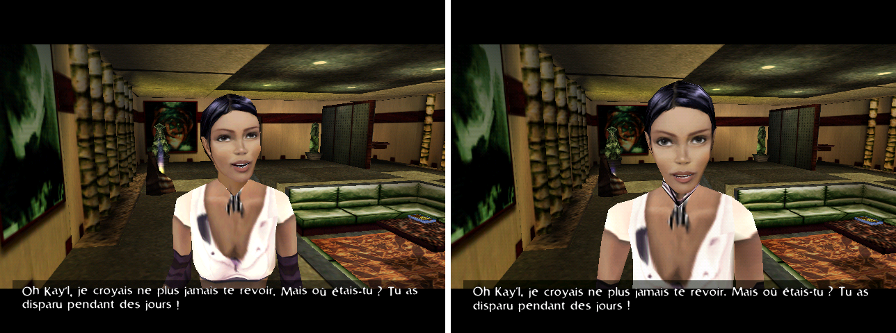

**Left: the original game**, its own framebuffer captured under CrossOver
(`traces/frames/dlg402-44.png`). **Right: OMK** at the same moment, reached
from a save with no input: dialogue 402, Telis greeting Kay'l, camera 4555
parked at the end of its travel, 640x480 letterboxed. The set, the lighting,
the camera, the subtitle and its font match; Telis's head is turned slightly
differently, and the plant on the left is lit differently.

### OMK as it draws by default

<p>
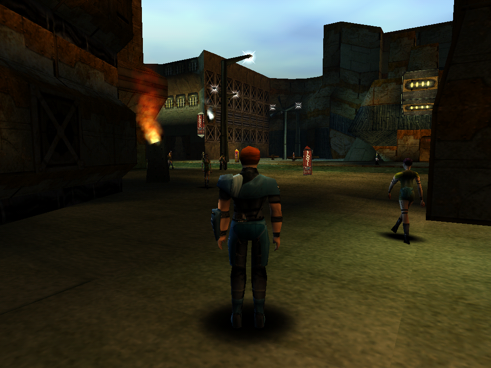
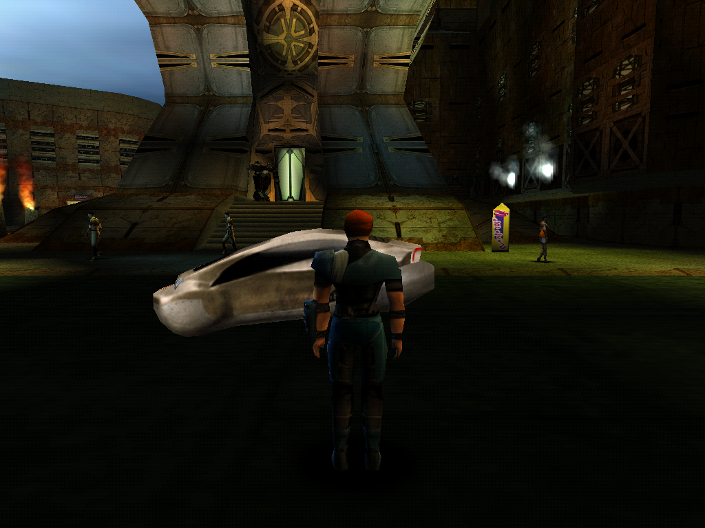
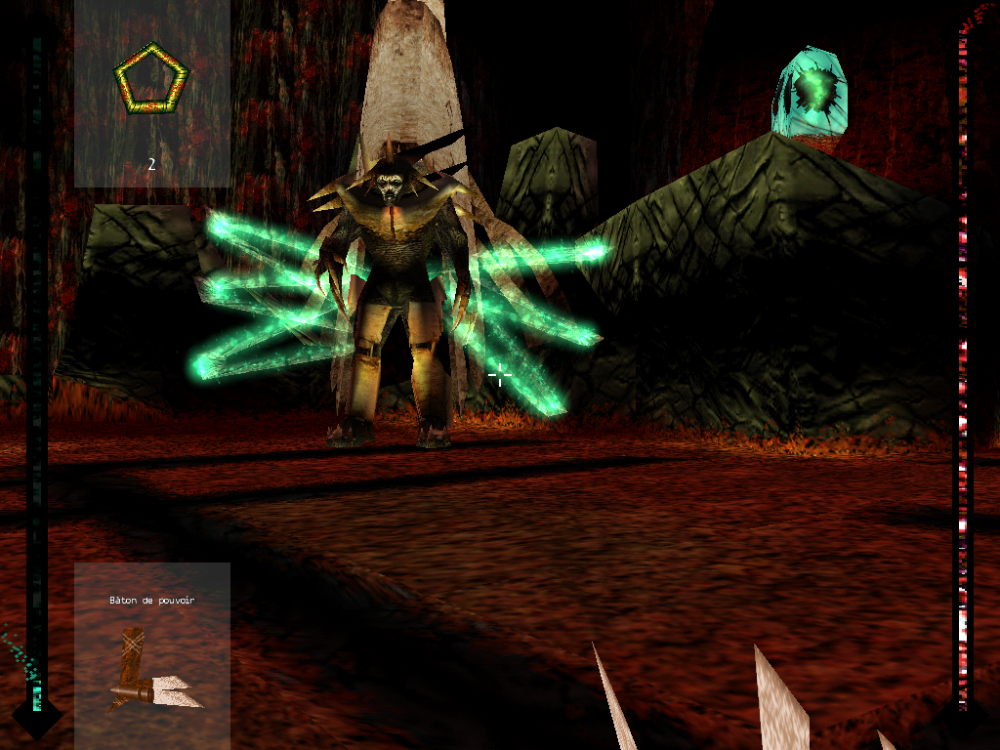
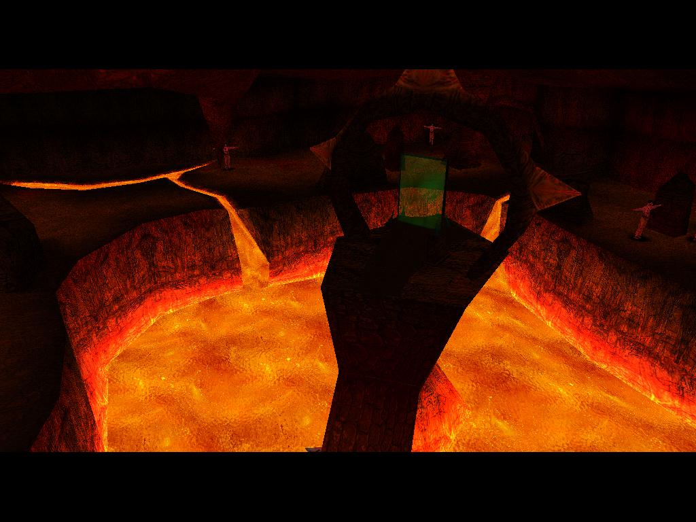
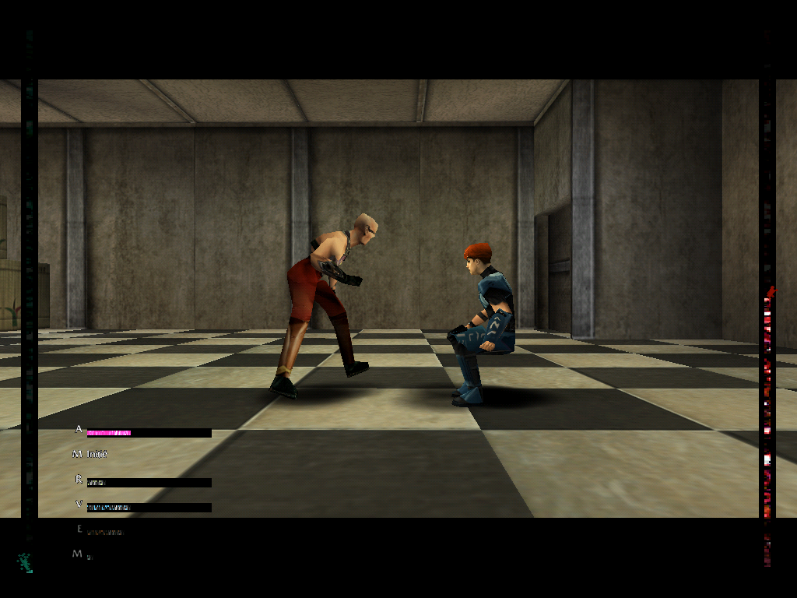
</p>

In order: **Anekbah** in adventure mode — the follow camera, the crowd, the
set's lamps and the engine's blob shadows; **traffic** — a slider parked by
the bank, walkers on the circuit, steam from the set's emitters;
**Astaroth** in first-person shoot mode, with his souls, the HUD and the
inventory slot; **Gandhar's lava cave**, from the meeting's camera editing;
and **melee**, the fight after the supermarket, with both health bars.

### Faithful against enhanced

The enhancements are everything the original never did, and all of them are
off unless asked for (`todo/enhancements.md`). In each pair **the left is the
faithful default and the right the enhancement**; crops are enlarged with
nearest-neighbour scaling.

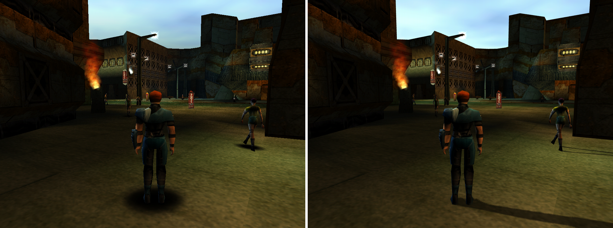

**Everything on** (`--enhance-all`): 4x MSAA (the most an M1 offers when 8x is
asked for), trilinear filtering with 16x anisotropy, mapped shadows, per-pixel
lighting, text scaling, a filtered interface and no draw-distance cap. The
shadow is the biggest change. Supersampling is not part of `--enhance-all`; it
is asked for by name.

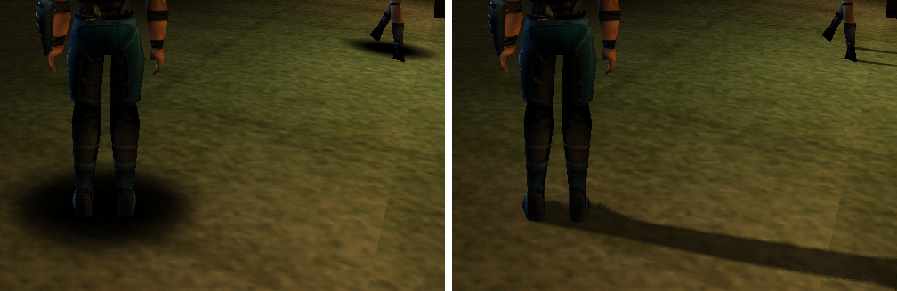

**Mapped shadows** (`--shadow-quality mapped`). The original lays soft discs
under a fixed set of bones; this is a real shadow map, cast from the set's own
lamp nearest the player, characters only. *Limits:* the set casts nothing,
because its shadows are already painted into its vertex colours; one light at
a time; a 220-unit slab around the player, outside which bodies cast nothing.
The crowd keeps its blob.

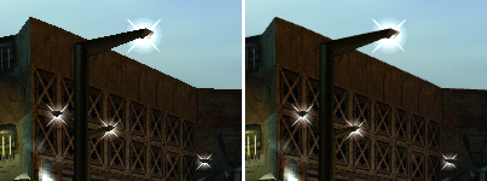

**Anti-aliasing** (`--aa 4`, MSAA), crop x3: geometry edges are smoothed — the
roof line and the lamp post. *Limits:* MSAA samples only triangle edges, so
cut-out textures (grilles, railings) and texture detail stay aliased; that is
what supersampling is for. Not on the Vita, whose vitaGL refuses it.

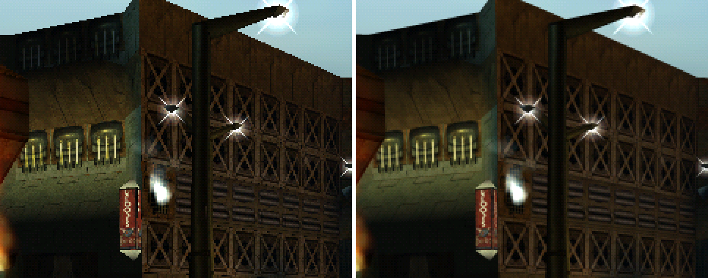

**Supersampling** (`--ssaa 4`), crop x3. The frame is drawn 4x larger each way
and averaged down, which reaches the cut-out edges and texture shimmer MSAA
cannot: compare the window bars and the grille. *Limits:* by far the most
costly — 16 times the pixels at 4x, which is why `--enhance-all` leaves it
out — and it softens the artists' own texture detail.

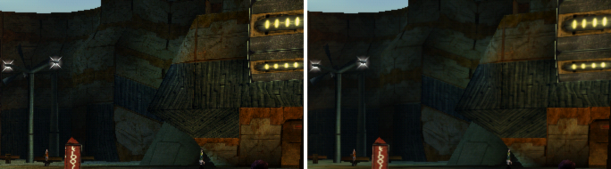

**Trilinear filtering and 16x anisotropy** (`--filter trilinear --anisotropy
16`), crop x2. The original shipped one texture level and no mipmaps, so
distant walls shimmer as the camera moves; mipmaps steady them. *Limits:*
distant detail goes softer, and small bright sprites lose intensity with
distance — the lamp flares on the left are visibly dimmer. A still frame
cannot show the shimmer it removes. Anisotropy is refused on the Vita.

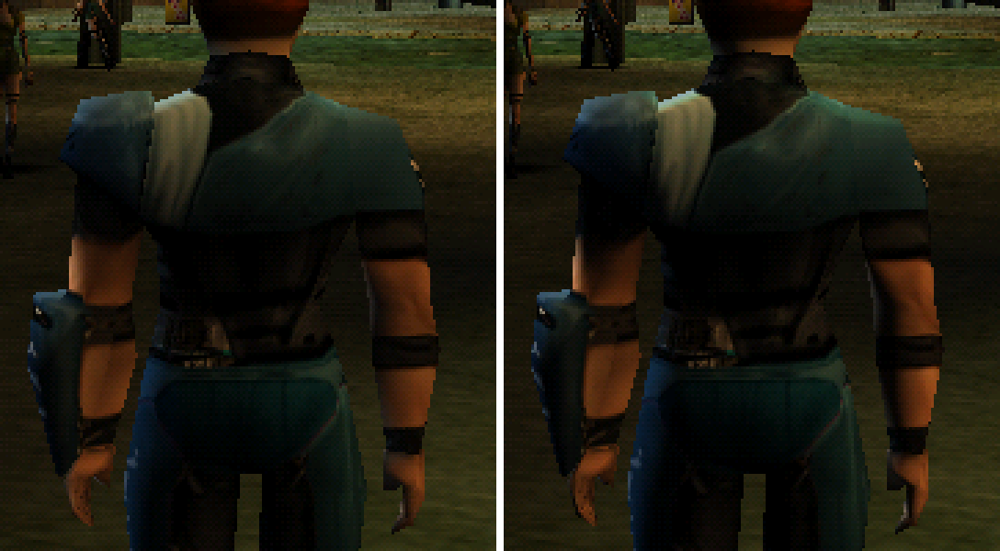

**Per-pixel lighting** (`--lighting perpixel`), crop x3. The engine's own light
law — the set's lamps falling on a body — evaluated per pixel instead of per
vertex, so a lamp's pool no longer bends across a low-polygon arm in flat
facets. *Limits:* subtle by design; the law is unchanged, so it matters only
where a light's edge crosses a body. The sets are not relit: their light is
painted in, and adding the lamps again would double it.

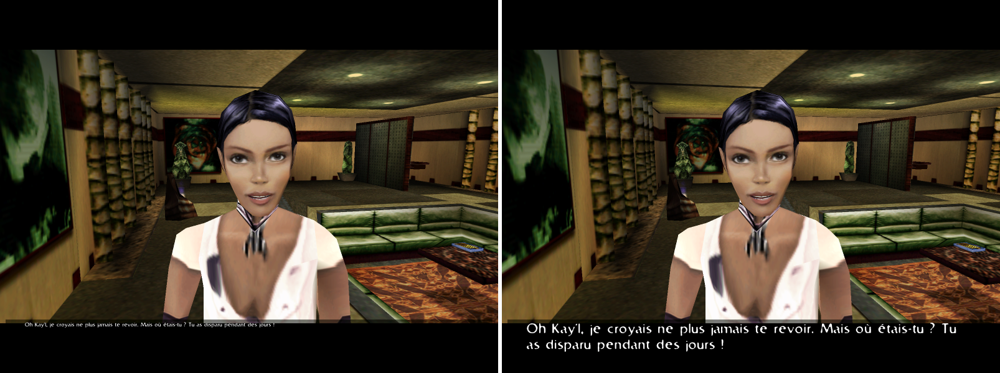

**Text scaling** (`--text-scaling fit --ui-scaling linear`), whole frames at
1600x1200. The original moves the interface's coordinates with the resolution
but draws every glyph at its native size, so the subtitle shrinks as the
display grows (left); `fit` scales the glyphs with the layout and sharpens the
filtered edges. *Limits:* the glyphs are the 1999 bitmaps, enlarged and
sharpened, not redrawn.

**Not pictured, because a still cannot show them:** 60 fps (`--framerate 60`)
and bodies smoothed between keys (`--smooth-anim`); an unlimited draw distance
(`--clip 0`), which buys nothing measurable at the option's 200 m maximum,
since no shipped set has a sightline past it; fitted shadows
(`--shadow-quality fitted`), identical on a flat street and different only on
stairs and slopes; and the shoot radar in every arena (`--radar always`).

## You need your own copy of the game

**No game data is in this repository, and none ever will be.** Nothing here is
useful on its own; everything reads a copy of the game you supply.

```
omk/
  gamedata/    <- YOU PROVIDE THIS: the game's data directory, from your disc
                  or your GOG install. Must contain the engine's
                  `Runtime.exe` (see below), `IAM/`, `MESHES/`, `SCPTDATA/`,
                  `MORPH/`, `SOUND/`.
```

Put it anywhere you like instead — a flag, an environment variable or a config
file, in that order of precedence:

```sh
python3 tools/verify.py --data /Volumes/OMIKRON1     # a flag
OMK_DATA=~/games/omikron/data python3 tools/verify.py # the environment
cp omk.conf.example omk.conf && $EDITOR omk.conf      # once, for good
python3 tools/omkpaths.py                             # what resolved where, and why
```

The directory used to be called `fr/`, from a first test against the French
release. It was never a French thing — the executable is the same for every
localisation — so it is `gamedata/` now.

`gamedata/` is **input, and is never written to**. Every tool that takes an
output path routes it through `omk::safeOutputPath`, which refuses any path
inside the shipped tree or carrying a shipped-data extension — because a tool
whose second positional argument was its output once truncated a 26 KB mesh
from the 1999 disc, and the check that noticed ran afterwards.

### The disassembly is optional, and is not here

**Which executable?** Two builds of the engine shipped and both are called
`Runtime.exe` — one asks for the CD, one does not, and every address in this
repository refers to the **no-CD** build. A tree holding both has to rename
one; this one carries it as `Runtime 2.exe`, which is local housekeeping and
means nothing about the game. **You do not have to rename anything**: the tools
resolve it by size (`omkpaths.exe_path()` takes the largest candidate — the
engine is ~985 KB, the launcher ~280 KB), so a fresh copy works as it comes,
and they warn rather than fail if only a launcher-sized file is present.

Some analysis tools read an IDA listing of that engine (`Runtime.exe.asm`,
`Runtime.exe.c`) and the `clean/` tree derived from it. **A disassembly is a
derivative work of the binary it came from, so this repository does not
distribute one.** Producing your own is up to you; point at it the same way:

```sh
OMK_ASM=~/ida/Runtime.exe.asm OMK_CLEAN=~/ida/clean python3 tools/verify.py
```

Without it, **the 18 checks that read it report `skipped`** — naming the
variable to set — and the rest of the suite's 577 run normally. `tools/dialog_disasm.py`
falls back to the committed `tables/vm_opcodes.json`, which carries the same
VM table; `verify.py: vm table sources` asserts the two agree, 153/153 operand
counts and 49/49 `.TAG` domains, so the fallback cannot drift unnoticed.

## Quick start

```sh
# 1. put your game data at ./gamedata  (or point OMK_DATA at it)

# 2. check your toolchain              (optional; it only reports and advises)
./scripts/install-deps.sh

# 3. build the replica                 (C++20 compiler; ~11 s from clean)
cd engine && make && cd ..

# 4. boot it
engine/build/omk gamedata --tables tables

# 5. check that everything the docs claim is still true
python3 tools/verify.py --list                 # all 577, and which doc quotes each
python3 tools/verify.py --only "engine: cull"  # one check, seconds
python3 tools/verify.py                        # the fast list, 244 of them
python3 tools/verify.py --slow --jobs 6        # all of it, six at a time — about half an hour
```

`--only` is the everyday form; the whole `--slow` sweep runs serially in
well over an hour, and `--jobs N` runs each check as its own process with
the builds kept serial behind one lock.

`verify.py` exits with the number of failures, so it drops into a hook or a
`&&` chain. Checks whose inputs you have not supplied report `skipped` rather
than failing.

### Dependencies

**The Python side needs nothing** — every tool is standard library only, and
`verify.py` deliberately has no PIL dependency (`tools/frame.py` carries a
PIL-free PNG codec to keep it that way). There is no `requirements.txt`
because there is nothing to put in it.

**The C++ side needs only a C++20 compiler.** SDL and the Vulkan loader are
optional and enable the viewers; `make` and `verify.py` work without either,
and `docs/PORTING.md` A1 requires that they keep working without either.
`scripts/install-deps.sh` reports what is present, `--install` adds the
optional pieces via Homebrew, apt, dnf or pacman.

### Platforms — portable by construction, developed on macOS

OMK is written to be platform-independent: C++20 with no dependencies, a plain
Makefile driven by `pkg-config`, Python that is standard library only, and an
install script with Homebrew, apt, dnf and pacman branches. **The game code
asks which machine it is on in one place only**: `engine/src/platform/`, where
`datafs`, `threads` and `profile` choose a file API, a thread API and a clock
for the Vita, the 3DS and classic Mac OS. Nothing else under `engine/src` has
an operating-system `#if`; the rest lives in the backends, and the viewer's
game code reaches its host only through `omk::Frontend`.

**Desktop development is on macOS on Apple Silicon**, and the four machines
in the table above each have their own build. **Windows and Linux desktops
have never been tried**, so treat them as unexplored rather than supported.
Four things are known in advance to need attention there:

* **Case-sensitive filesystems.** The game shipped with inconsistent casing
  because Win95 did not care, so the C++ `DataFs` resolves every lookup
  case-insensitively and is expected to be fine anywhere. The **Python
  readers do not** — they let the host filesystem do it, which works on macOS
  and will not on a case-sensitive Linux volume without normalising the tree
  first. Expect the engine to run and some of `tools/` to fail.
* **The golden-trace rig is macOS-only by construction.**
  `tools/goldentrace.py` drives the original Windows executable under
  CrossOver and captures frames with `screencapture`, including a 2x Retina
  recovery. Its checks skip without it; the rig itself would need rewriting
  elsewhere.
* **Vulkan reaches the GPU through MoltenVK here.** OMK only ever talks to the
  loader, so a native driver should need no change — but that is a
  reasonable expectation, not a tested one.
* **`scripts/install-deps.sh`'s Linux branches are written, not exercised.**

Reports from other platforms are welcome, and so are the failures: a bug
found by someone building on Linux is worth more than another macOS run.

## Playing it, and looking at it

```sh
cd engine && make play                     # needs SDL2 or SDL3
build/omk-play ../gamedata ../tables       # THE GAME: movies, menu, intro,
                                           # then adventure mode
```

Arrows walk and turn, either Shift runs, `ENTER` advances a conversation and
chooses a reply, any key skips a movie and `ALT` skips all three. Once he is
on his feet, `TAB` opens the sneak (through the `.CTL`, so not instantly):
`LEFT`/`RIGHT` move between the device's columns, `UP`/`DOWN` within one,
`ENTER` opens a tab or confirms a row and its verbs. The adventure scheme's
action binding picks up an object in front of you; `build/omk-play --help`
lists every key and every flag, including the harness flags (`--give`,
`--scene-chunk`, `--sneak`, `--scx-play`…) that reach a flow without the
script that would.

The same binary is also a free-look viewer for one set, which is how a
rendering question gets answered by eye instead of by metric:

```sh
build/omk-play ../gamedata ../tables --scene Aapkayl     # a set, live
build/omk-play ../gamedata ../tables --scene Aapkayl --vulkan   # on the GPU
```

`W/S` fly, `A/D` strafe, `Q/E` up and down, arrows look, `[`/`]` step the
set's own cameras, `L` cycles the baked vertex light, `V` swaps the software
rasterizer for the Vulkan backend, `P` prints the current camera in a form you
can paste into a check.

`omk-play` draws in software by default, the reference every other renderer is
checked against. `--vulkan` presents through Vulkan, and `make play-gles`
builds `build/omk-play-gles`, the OpenGL ES path the Vita and the Quest use.
`make release` builds without the instruments and the profiler; with them,
`omk-play --profile run.prof` records a frame-by-frame profile and
`tools/omkprof.py` reads it or serves it as a page (`todo/debug-tools.md`).

And four web viewers that read the data directly rather than through the
replica:

```sh
python3 tools/omkweb.py --port 8752     # http://127.0.0.1:8752
```

`/dialog` plays a conversation — text, branching replies, ADPCM audio, the
speaker posed from the morph data, staged in its set under its own dialogue
cameras. `/cutscene` flies an in-engine cutscene with its ambient particle
emitters. `/ui` drives the game's own menus with its own input words.
`/world` serves the world scripts as annotated listings.

## What is established

Solved and documented with evidence: the `IAM` archives and conversations, the
script VM (153 opcodes, 129 named, 99.97% of executed instructions), textures
(2534/2534 exact), meshes and sets, the animation libraries (243362/243362
unit quaternions), the `.CTL` state machines (7/7 exact, all 2044 graph edges
resolving), the scene scripts (220/220), morph animation and its ADPCM audio
(777/777 sample-identical), the trigger zones (4558, 0 bad), the world scripts
(5785/5785 slots decoding), the game state, the fonts and text layout, the 37
interface screens and their widget tree, the effect sprites, the fight and
shoot AI (the two bosses' brains among them), the cutscene camera editings
(24112/24112 frames sampling), the street's traffic circuit, the graphical
options and what each one sizes, the blob shadows, the `.3DO` light table
that lights every moving body, the clock's day and night, and the shipped
render states — bilinear on a 3D card, a dither on both device arms, and a
back-face cull done in software above a device set to cull nothing.

`docs/RECONSTRUCTION.md` is the roadmap and the running log — what is left, in
what order. `engine/README.md` audits the port row by row against that list,
and it has been wrong twice, so read it rather than any summary of it.

Open questions are listed in `CLAUDE.md` §6 **with what has already been ruled
out**, so nobody repeats a search.

Two retellings sit beside the docs, and both are **derivative**: neither
establishes anything, and where either disagrees with `docs/`, `docs/` is
right.

* [`book/`](book/README.md) — *How Omikron Works*, the engine and the port
  told in order for a developer new to both, with diagrams and Unity/OpenGL
  analogies (`omk-book.pdf`). An edited draft, updated when a finding it
  retells changes.
* [`manual/`](manual/) — the illustrated walkthrough, in two registers per
  chapter (a plain summary and the technical account). A **snapshot**: by its
  own first rule it is regenerated **only when explicitly asked for**, never
  as a side effect of other work.

## How this work is done

`CLAUDE.md` is the working practice, and it is worth reading before the docs.
Its ground rules exist because ignoring each one produced a wrong result that
survived until something else contradicted it. The short version:

* **The data is for finding, the code is for confirming.** Explore the bytes
  freely — but a layout is not established until a loader in the binary says
  so. A wrong layout that happens to fit the shipped bytes looks exactly like
  a right one, and fails silently.
* **Make the parse self-checking.** Prefer a test the data can fail: a walk
  that must land exactly on the file size, a pool consumed in order with no
  gaps, every cross-reference resolving. "It decodes without crashing" is not
  a check — random bytes decode.
* **A value verified standing still is not verified moving.** An angle stored
  near 4096 is a small negative one: identical in every still frame, and a
  full wrong turn once two of them are interpolated. Write the invariant over
  the transition.
* **Look at it.** A suite that only compares this repo to itself cannot see a
  wrong reading applied consistently. Several findings here were corrected by
  somebody watching the viewer, after every number in the repo had agreed with
  every other.
* **Record the dead ends.** A negative result is a finding, and it is only as
  strong as the enumeration behind it.

Every number quoted in `docs/` is asserted by a check in `tools/verify.py`, so
the prose and the code cannot drift apart.

## Built with AI, and why that shapes everything above

OMK was written with heavy use of AI — Claude, via Claude Code. The
sessions in [`transcript/`](transcript/README.md) are the archived record of
its first fortnight (2026-08-26 to 2026-09-06), kept deliberately: they
contain the wrong turns as well as the findings, and several of the ground
rules above are only convincing with the mistake that produced them still
attached. No later session is added; the docs and the commit log carry the
work since.

That is stated here rather than buried, because it changes what a reader
should ask of the work.

**It is also the reason the verification apparatus is as large as it is.** An
LLM produces fluent, confident, plausible answers, and in a format-archaeology
project the failure mode is specific and nasty: *a wrong layout that happens to
fit the shipped bytes looks exactly like a right one.* It decodes without
crashing. It produces round numbers. It reads well. So the rules are not
stylistic — nothing is established until a loader in the binary says so, every
finding that produces a number gets a check, and a check must be **shown** to
fail before it is trusted. `verify.py` exists because the author of most of
this text cannot be taken at its word.

That machinery has earned its cost repeatedly. A `SCENE` chunk count that
parsed beautifully as an int32 is an int16 in `Scene_Load` — the plausible
reading silently rejected 22 of 71 chunks. A confident "5016 scripts" was a
section offset read as a count. An asset sweep globbed `*.3DM` case-sensitively
and reported 708 files where 777 ship.

**And it is worth being equally clear about what the machinery did *not*
catch.** A suite that only compares this repository to itself cannot see a
wrong reading applied *consistently*. The dialogue staging was wrong through
two successive "fixes" while every check passed and every number agreed with
every other; one frame of the running game showed the error in a second. That
is why "look at it" is a rule, why the viewers exist, and why several of the
corrections recorded in `docs/` came from a human flying a camera rather than
from any test here.

So: the findings carry their evidence, and the evidence is the point. Read
that rather than the confidence of the prose around it — and if something here
is wrong, it will most likely be wrong in a way that reads perfectly.

## Licence

Two, split along the code/prose line:

* **code** — `tools/`, `engine/`, `scripts/`, `tables/` —
  **GPL-3.0-or-later** ([`LICENSE`](LICENSE)). Copyleft is the norm for game
  reimplementations, and it keeps a closed commercial fork off the table.
* **prose** — `docs/`, `CLAUDE.md`, `README.md`, `todo/`, `transcript/` —
  **CC-BY-4.0** ([`docs/LICENSE`](docs/LICENSE)). The findings are the part
  most worth quoting elsewhere, and copyleft text would block exactly that.

[`LICENSING.md`](LICENSING.md) has the reasoning, the third-party inventory
(`engine/third_party/pl_mpeg.h` is MIT and is **not** relicensed by any of the
above), and what is deliberately kept out of the published tree.

**These licences cover only what OMK owns.** *Omikron: The Nomad Soul*
is © Quantic Dream / Eidos Interactive. OMK redistributes none of it,
is not affiliated with or endorsed by either, and is published as
documentation of file formats for interoperability. Neither the game data nor
any disassembly of its binary is here, and no licence on this repository would
change their status if they were.
