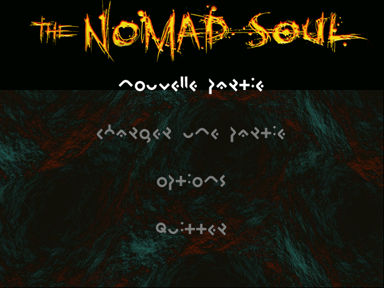
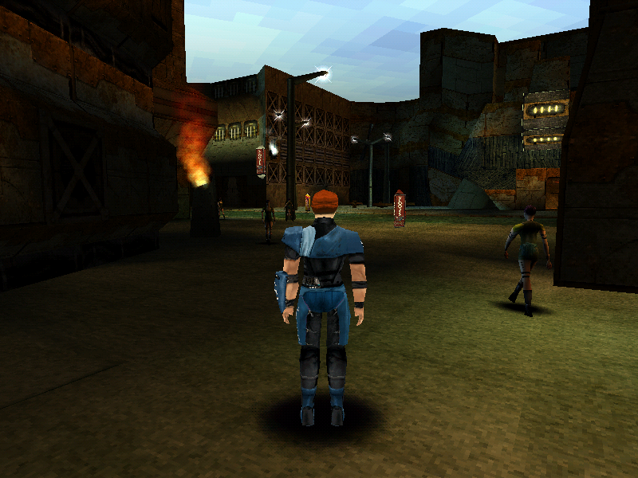
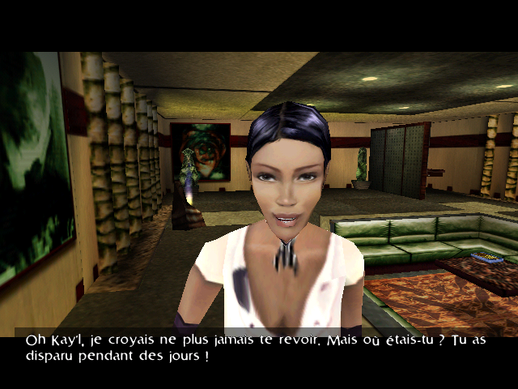
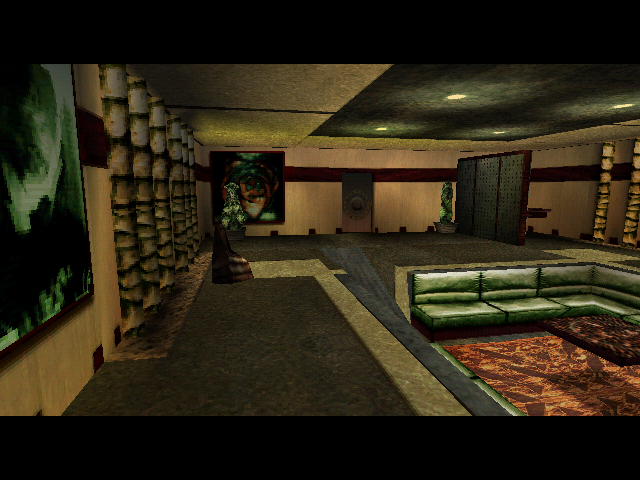
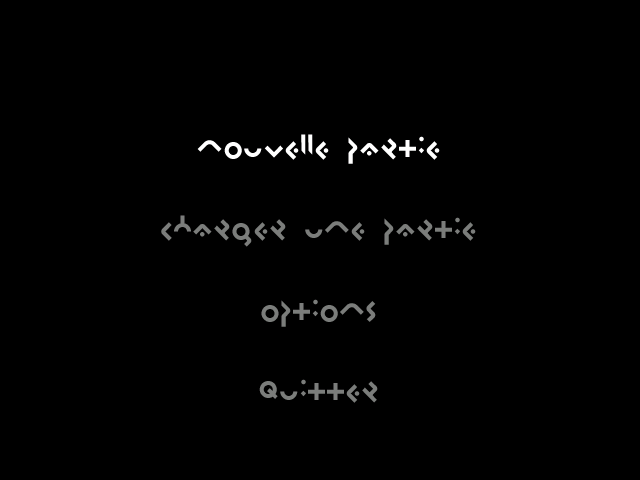
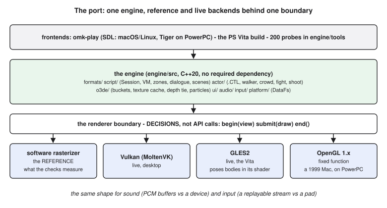
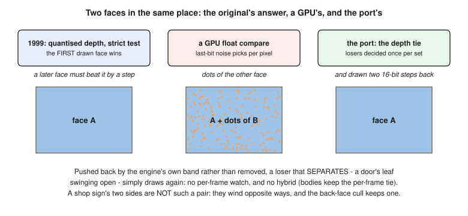

<div class="title">

# How Omikron Works

<p><strong>The engine of <em>Omikron: The Nomad Soul</em> (1999), and the replica that runs it again</strong></p>
<p>A book for developers, to be read in order</p>
<p><em>Draft of 2026-09-29</em></p>

</div>

<div class="pagebreak"></div>

<!-- TOC -->

# Before you start

## Who this is for

You write games or tools. Maybe you know Unity well, you have read some
assembly, written some C and C++, and pushed triangles through OpenGL. You
have never looked inside a 1999 engine, and you would like to understand one
properly: not the list of its file formats, but *why it is built the way it
is*, and what it takes to rebuild it on hardware its authors never saw.

That is what this book tries to give you. It follows one game, *Omikron: The
Nomad Soul*, from the moment its executable starts to the moment a pixel
reaches the screen, and then follows the project that reverse-engineered it
(**OMK**) through the rebuilding.

## How it differs from the manual

This repository already has a **manual** (`manual/`): thirteen chapters, each
with a plain summary and a technical account, the addresses of the functions,
the offsets of the fields, the checks that assert every number. It is a
reference. You go to it with a question.

This book is the other thing. It is meant to be read **from the first page to
the last**, and each chapter leans on the ones before it. It uses fewer
numbers, and only the ones that carry an idea. It explains mechanisms with
pictures and analogies, and when it needs a precise fact it tells you which
chapter of the manual, or which document under `docs/`, holds it. If the two
ever disagree, the documents under `docs/` win: this book, like the manual, is
*derivative*, a retelling of findings recorded elsewhere with their evidence.

## How it is organised

**Part I** looks at the game as a machine: what the executable is, what one
frame does, and where the game really lives, which is in its data files.

**Part II** is about behaviour: the tiny computer inside the game that runs
its scripts, the places the world is made of, the bodies that walk around in
them, and the stories told with conversations and cutscenes.

**Part III** is about output: how a frame was drawn in 1999, how sound works
without a mixer, and how the interface is built.

**Part IV** is short and a little different: how you read an engine you do
not have the source code of, and how you know when you have read it right.

**Part V** is the rebuilding: the shape of the replica, the renderers behind
it, the long work of making it fast enough for a handheld, and how that work
compares with what the original engine did.

Throughout, boxes like this one translate an idea into terms you may already
know:

> **From Unity:** a box like this maps an Omikron mechanism onto the closest
> Unity or OpenGL concept. The mapping is never exact, and the box says where
> it breaks.

## A running example

One scene comes back again and again: **Kay'l standing in Anekbah's main
street**, the city's crowd walking past, a street lamp glowing, a shop sign
hanging on a wall. It is the port's standard test scene, and nearly every
subsystem in this book shows up in it somewhere. When a chapter introduces a
mechanism, it will usually tell you where that mechanism is in this street.


<h1 class="part" id="part-i">Part I — The game as a machine</h1>

<div class="pagebreak"></div>

# 1. A machine and its content

## Three games in one coat

*Omikron: The Nomad Soul* was made by Quantic Dream and published by Eidos in
1999 for Windows. It is an adventure game in which you walk through a city and
talk to people; a beat-'em-up in which you fight them hand to hand; and a
first-person shooter in which you shoot them. Now and then you swim. Its
central idea is that you are a soul that can move from one body to another, so
the game must be able to hand you a different character at any moment and
carry on.

A game with that much in it sounds like it should need a very large program.
It does not. The executable is about **985 KB**. Everything else, about
**1.7 GB in 2 812 files**, is data.

## The split that makes it readable

What is compiled into the executable is not the game. It is a **machine**:

* an interpreter for a small bytecode language, which runs the game's scripts;
* a runner for state graphs, which moves the characters' bodies;
* a renderer, a sound bank and a 2D interface layer;
* one reader for each file format.

What the game *does* is all in the data. Which conversation starts when you
walk through a doorway, which camera watches it, which animation a character
plays when it turns round, which gunman patrols which corridor: those are
scripts, state graphs, meshes and tables in the files beside the executable.


<p class="caption">Figure 1 — The executable is the machine; the data is the game.</p>

This split is the single most important fact in the book, because it is what
made the whole reverse-engineering project possible. Read the machine once,
carefully, and the content reads itself: 5 785 scripts, 320-odd conversations
and hundreds of models become understandable, because they are all run by the
same few hundred functions.

> **From Unity:** think of the executable as the Unity player, the compiled
> runtime you never edit, and of the data as the scenes, prefabs, animator
> controllers and assets of a built game. The difference is that Omikron's
> "player" was written for one game only, so its data formats encode that
> game's ideas directly: a trigger zone, a conversation, a fight.

## What OMK is

**OMK** is the project this repository holds. It has two halves:

1. **The reading.** The findings about how the original engine works, each one
   tied to the function in the executable that establishes it. They live in
   `docs/`, and roughly five hundred automatic checks (`tools/verify.py`) keep
   every number in them honest.
2. **The replica.** `engine/` is a new implementation of the machine, written
   in C++20, which reads *your* copy of the game's data and runs it. It
   contains no game content and never will.

The replica is not an emulator. It does not execute the original machine code.
It re-implements what that code *decides* (which script runs, which state a
body enters, which triangles are drawn in which order) and uses today's
hardware to carry out those decisions.

## The words you will need

A handful of the game's own terms come back throughout:

| term | what it is |
|---|---|
| **area** | a place, such as a street, a flat or a corridor, stored as one chunk of an archive |
| **scene** | a second layer of content that can be loaded over an area: the cutscene material for a particular moment of the story |
| **set** | the 3D model of a place: its walls, floors, signs and lamps |
| **zone** | an invisible box on the floor that runs a script when you enter it, act inside it or leave it |
| **context** | one running script, with its own program counter and stack |
| **channel** | the state-graph runner attached to one body |
| **slider** | the flying car of the game's cities |
| **sneak** | Kay'l's handheld device: the inventory, the map, the notes |

You do not need to remember them now. Each gets its own explanation when the
story reaches it.

<div class="pagebreak"></div>

# 2. One frame

## The loop

Double-click the icon and the executable does five things in order. It starts
its subsystems. It plays three videos (Eidos, Quantic Dream, then a title
sequence). It loads a scene file called `aventure.scx`. It shows a splash
bitmap. Then it enters a loop that runs one frame at a time until you quit.

That loop is an ordinary Windows message pump. The game only runs a frame
when the pump has **nothing else to do**, and only while the window is in the
foreground. Switch to another application and the loop calls `WaitMessage()`,
which really blocks: the process stops using the processor. When you come
back, the first thing the next frame does is **throw away** the time that
passed. Without that, returning after a two-minute break would hand the
simulation a two-minute step.


<p class="caption">Figure 2 — One frame: the clock, the input, the scripts, the bodies, the scene, the draw.</p>


<p class="caption">The start menu in the game's invented alphabet: a frame of the original engine's own framebuffer, captured at 640 × 480 (<code>traces/frames/menu-22.png</code>).</p>

`aventure.scx` deserves a note, because its name suggests a menu. It is not
one. It is the game's global library of effect sprites and sounds. There is
no "menu state" in this engine. The start menu is a screen opened by the
first area's own startup script, over an ordinary scene: the same machinery
that later runs a street. Chapter 5 shows how.

## The clock counts frames

Every clock in the engine (animations, camera moves, the flicker of a neon
sign) is measured in **frames at 30 Hz**, not in seconds. That comes from one
line in the frame function, which sets the time step to

```
dt = 30 / fps
```

At exactly 30 frames per second, `dt` is 1.0. At 60 it is 0.5, and every
clock advances half a frame per rendered frame, so the game looks the same at
any rate. This is why durations everywhere in this repository are quoted in
frames. A clip "136 frames long" is four and a half seconds.

There is one more rule, and it matters for a slow machine: **`dt` is capped at
3.0.** Below 10 frames per second the game does not take larger steps. It
slows down. A replica that integrated real elapsed time on a slow console
would not be more accurate; it would be doing something the original never
did. The port learned this the hard way. On a PS Vita running at 200–300 ms a
frame, an earlier clamp of its own made the camera visibly "shake"; replacing
it with the engine's own cap of three frames fixed it.

> **From Unity:** `dt` is the engine's `Time.deltaTime`, but expressed in
> thirtieths of a second and clamped at 0.1 s, the equivalent of setting
> `Time.maximumDeltaTime`. There is no separate `FixedUpdate`: the whole game
> steps once per rendered frame, on this one variable.

## Two details at the edge of the loop

**Escape is not a key the game binds.** The loop reads it directly, just
before the frame, and opens the pause screen itself. The pause does more than
set a flag: the pause screen's open callback suspends every sound buffer and
music stream, and its close resumes them from where they were.

**The intro films have two skips.** Any key ends the film that is playing;
**Alt ends all three**. One reads a key held down, the other sets a latch that
nothing ever clears. It is a small thing, but it shows the style of the whole
engine: behaviour lives in a few lines of plain code, and every one of those
lines matters.

## What this means for the rest of the book

Everything that follows happens inside one pass around Figure 2. The scripts
run first, then the bodies move, then the scene objects play, then the frame
is drawn. No threads anywhere. A script that needs to wait for something
cannot block, because blocking would stop the entire game. How the engine
waits without blocking is the subject of chapter 4, and it is one of the most
elegant ideas in it.

<div class="pagebreak"></div>

# 3. Where the game lives

## The shipped tree

The data directory holds a dozen folders. Each belongs to one or two
subsystems:


<p class="caption">Figure 3 — The data folders, what they hold, and which part of the machine reads them.</p>

The most important is `IAM/`, 67 files. Most of them are **archives**: one
file holding hundreds of numbered chunks behind a directory at its start.
`IAM\AREA` holds the places. `IAM\SCENE` holds the scene layers. `IAM\DIALOG`
holds the conversations. `IAM\GLOBAL` holds the scripts that apply everywhere.
The interface text and the saved games are in `IAM\` too.

## Plain formats

The whole project was possible largely because the formats are **plain**.
Nothing is encrypted, there is no versioning beyond one field, and the little
packing there is (textures are LZ-packed unless an image is exactly 64 KB; the
audio is ADPCM) is simple and decodes exactly. A record is a C struct written
to disk, an array is an array, and its count is usually right there beside it.
A texture is a palette followed by indices. A mesh is a list of records of fixed size, 140,
32, 28, 32 and 52 bytes for its five kinds of record.

This was normal in 1999. Loading was mostly a matter of reading a file into
memory and fixing up the pointers inside it. It explains a style you will see
again and again in the engine: a structure read from disk *is* the structure
the engine uses at run time. Some fields in a file are placeholders that the
loader overwrites the moment it reads them (a texture's slot number, for
instance, ships as −1 in every one of the 2 534 materials), because on disk
they have no meaning yet.

> **From Unity:** there is no asset database and no import step. What Unity
> does once in the editor (convert, compress, build atlases) Omikron's tools
> did offline, and what shipped is already the runtime layout, closer to a
> memory dump than to a `.prefab`.

## A file is often more than its name

Two examples, both found only by reading the code that uses the data:

* A `MAP2D` file is the map the player sees in the sneak, and **also** the
  navigation grid the gunmen walk by in shoot mode.
* A mesh flag that makes a distant skyline **shimmer** (its vertex colours
  oscillate on the frame clock) also marks the bed of a canal you can swim in.

Nothing in the data announces a double use like that. This is the first hint
of a principle Part IV makes explicit: the data can tell you where to look,
but only the code can tell you what a field *is*.

## Case, and a lesson from a console

One more property of the tree turned out to matter the moment the replica ran
anywhere but Windows. **Windows 95 and 98 did not care about letter case in
file names, and the game relied on that.** The executable asks for
`FLIS\EIDOS.mpg` while the disc ships `EIDOS.MPG`. On macOS or Linux that is a
missing file. The replica therefore opens every file through one class,
`DataFs`, which resolves names without regard to case. It resolves all 2 367
files it is asked for under four different manglings of their paths.

The PS Vita port added a lesson of its own. A copy of the `IAM` archives made
with an FTP client in *text* mode had its line endings "corrected", which
silently damaged binary chunks. The symptom was an empty area where the
game's first scene should have been. Binary data must be copied as binary,
and a symptom that looks like an engine bug may be the copy.


<h1 class="part" id="part-ii">Part II — How the world behaves</h1>

<div class="pagebreak"></div>

# 4. A tiny computer inside the game

## Bytecode

When you walk into a doorway in Omikron, a script runs. It is **bytecode**:
one byte names the instruction, and its operands follow. A table compiled
into the executable has 153 entries, each a pair: the address of the handler
function, and how many operand bytes the instruction takes. The interpreter
reads a byte, looks it up, calls the handler, and advances past the operands.

There are **5 785** such scripts in the shipped game, and between them they
say almost everything the game does: *this conversation starts here*, *this
door opens*, *this camera watches*, *this variable is now 1*, *this gunman
patrols that corridor*.

The instruction set is small and specific. Here are a few of its opcodes, with
the names this project gave them (the original's names were not shipped):

```
dialog.start   272        start conversation 272
ui.open        29, -1, -> variable 19   open screen 29, store its answer
camera.set     2148       cut to camera 2148
scene.load     237, 57    load scene 57 over area 237
music.play     15         play TRACKS\15.ADP
render.grey.on            switch the scene renderer to greyscale
```

The last one is a nice surprise. Opcodes 150 and 151 swap the whole scene
renderer to a second, greyscale version and back, and every use of them
brackets a run of camera instructions. So the game has **black-and-white
cutscenes**, switched on by the script that plays them.

> **From Unity:** a script here is closer to a coroutine than to a
> MonoBehaviour. It has no `Update()`. It runs from its first instruction
> until it has to wait for something, and it resumes exactly where it
> stopped. How it "waits" without `yield return` is the next section.

## How a script waits

This is the idea to take away from the chapter.

The whole game is one loop with no threads (chapter 2). So a script that opens
a menu, or starts a fight, or waits for a character to finish walking, **must
not block**: blocking would freeze everything, including the menu it is
waiting for.

Instead, each running script, called a **context**, has a **status word**. The
interpreter runs a context only while its status is 1:

```c
while (ctx->status == 1)
    execute_one_instruction(ctx);
```

An instruction that has to wait simply writes a different number into its
own context's status word and returns. The interpreter loop sees the status
is no longer 1, and stops running that script. Its program counter and its
stack are untouched. The script is **parked**.


<p class="caption">Figure 4 — A script parks by writing its own status; the event that answers it writes 1 back.</p>

Later, whatever it was waiting for happens (the screen closes with an answer,
the fight ends, the camera move finishes) and the code that handles that
event writes 1 back into the status word. On the next pass the interpreter
runs the script again, from the next instruction. **Nothing polls.** Every
resume is an event.

The status numbers name what the script is waiting for: 3 for a fight, 4 for
a scene object or a player move, 6 for a screen, 7 for a camera move, and
8 to 11 for the stages of an area transition. One value, 5, is used for a
transition that a second transition has overtaken, and nothing in the whole
executable ever resumes it. That is not a gap in the reading. It is the
original's own shape: such a script is parked for good.

This design is why a conversation can interrupt a cutscene, why an area
transition can take three seconds of streaming without the game stopping,
and why the engine never needed threads.

## A script belongs to a place

Scripts are stored inside the places they belong to, and they name things
(scene objects, cameras) by small numbers that are **local to that place**.
Object 12 in one scene is not object 12 in another. Because two places are
loaded at once (chapter 5), a script must always be read against the place it
came from. An early search for "which scripts start the Impasse's cutscene"
found eight candidates across the corpus. Every one of them was another scene
addressing its own object 12, and the real answer was zero: that cutscene is
started by something else entirely, the scene's *startup script*, which the
next chapter introduces.

## How the game starts talking to you

You can now follow the first minute of a new game with the real mechanism.

1. The frame loop loads the starting area, number 118, "Introduction Kay'l".
2. Loading a place **starts its startup script**. Nothing needs to name it;
   arriving *is* the trigger.
3. That script reaches `ui.open(29, ...)`, which opens the start menu and
   parks the script at status 6.
4. You type a name and confirm. The screen's answer is written into variable
   19 and the context's status goes back to 1.
5. The script carries on and reaches `dialog.start 272`: Kay'l's first
   conversation.

The replica does exactly this, with nothing wired by hand, and its record of
what the scripts did matches a capture of the original game, event for event:
42 of 42 in order. Part IV explains how a capture of the 1999 executable was
possible at all.

<div class="pagebreak"></div>

# 5. Places

## A place is a chunk

The world is a set of **places**, and a place is a chunk in an archive. An
area chunk carries its set, its characters, its props, its scripts, its shop
stock and its trigger zones. A scene chunk, loaded over an area, carries the
material for a moment of the story: which objects appear, what they do, which
cameras film them.

Four ideas carry the whole subject.

## 1. A place runs a script the moment it loads

A chunk's offset `+4` holds its startup script. The loader hands it to a new
context and queues it as soon as the chunk arrives. 173 of the 330 area and
scene chunks carry one, and all 173 disassemble cleanly. This is what starts a
new game (chapter 4), and it is also what orders a cutscene's beats: the
Impasse cutscene's sixteen beats are fired, in order, by its scene's startup
script, which then hands over with `scene.load(237, 57)`.

That fact stayed hidden for a while, and the reason is instructive. Every
search for "who starts these beats" enumerated the scripts found in the trigger
zones and the message subscriptions, 5 785 of them, and none of them did. The
search was correct. The *inventory* was incomplete: startup scripts were not in
it. A negative result is only as strong as the list it searched.

## 2. Everything else is a trigger zone

A **zone** is a quad on the floor, plus an arc saying which way you have to be
facing, plus up to three scripts: one for entering, one for pressing the action
button inside it, one for leaving. There are **4 558** of them. Each has one
bit in the saved game, which is how a one-shot event stays shot.

> **From Unity:** a zone is a trigger collider with `OnTriggerEnter`,
> `OnTriggerExit` and an "interact" event, except that the three handlers are
> bytecode stored in the level, and the "has this fired?" flag is part of the
> save file rather than of the object.

## 3. Two places are loaded at once

When you walk out of a street into a building, the street is not thrown away.
It stays resident in the second of two **slots**, its animations still running.
Walking back is not a reload.


<p class="caption">Figure 5 — The active slot is drawn; the hidden one is not, but it is still loaded and still solid.</p>

## 4. Hidden is not gone

A place that is loaded but not shown is **still solid**. Its walls still stop
you, and a step onto its floor is undone. One building in the game is laid out
around that property.

It has a subtler consequence too, in the texture cache. The engine hands out
58 texture slots from one global pool and matches textures by **file name
alone**. When a new set loads while the old one is still resident, a texture
with the same name is taken from what is already in memory, even if the new
set's copy of that file has different pixels. 182 texture names ship with
different pixels in different sets. So some Anekbah signs genuinely draw a
little differently depending on which neighbouring place you walked in from.
The port reproduces that, because the original did it. It is one of several
places in this book where being faithful means reproducing a quirk.

## State that survives

Everything the story remembers lives in one block of **8 192 bytes**: the
variables scripts set, the zone bits, the inventory, the player's record. A
new game starts from a template, `IAM\START`, which is itself just a saved
game with no scripts in it. The save file stores the same block, plus the
settings: saving a game also saves your options. A save costs one ring,
*anneau*. (What happens when you have none is one of the places where the
records still disagree with each other, and the manual lists it as open.)

<div class="pagebreak"></div>

# 6. Bodies

## A character is a tree of meshes

A character model (`.3DO`) is a hierarchy of meshes: a pelvis, a chest, the
upper and lower arms and legs, a head, each parented to another by an ID.
The **pelvis is the root** in all 181 character models. An animation clip
(`.ani`, or `.3DA` for a scene's own clips) stores one rotation per mesh per
frame as a quaternion, plus a root track for movement. Posing a body means
walking the tree, composing each mesh's rotation with its parent's, and
transforming its vertices.

One detail catches everyone: **key 0 of a track is a rest pose, not frame 0.**
A clip of *N* frames holds *N + 1* keys. Read key 0 as the first frame and
every loop shows a one-frame T-pose.

> **From Unity:** this is a skinned mesh, except that each vertex belongs to
> exactly one bone. It is rigid skinning, with no weights. A body is a
> hierarchy of GameObjects each carrying its own piece of mesh, and a clip is
> an AnimationClip of local rotations. There is no blending tree beyond a
> short cross-fade.

## A body's behaviour is a state graph

Every character, the one you steer and the ones you do not, is driven by the
same machine: a **state graph that shipped on the disc**, a `.CTL` file. Each
state names an animation. Each transition names the **input bits** that take
it. Press forward, and the graph moves from standing to walking, because an
author drew that edge. Press the action button next to an object and it walks
a chain of states: an adjusting step into position, a reach, a stand-up with
the object in hand, a wait, and then, on your next press, into the bag or
cancelled.


<p class="caption">Figure 6 — A state graph (illustrative: <code>H_STAND</code> and the take chain, from <code>todo/take-animation.md</code>, are real; the walk and run states are drawn for the idea).</p>

The input is **fourteen bits**, one word shared with the interface. Which key
sets which bit depends on the context. There are four control schemes
(adventure, swimming, shooting, fighting), each binding 14 actions on three
devices. Entering a fight installs the fight scheme, entering shoot mode the
shoot scheme.

This makes something that looks complicated turn out simple. "The player draws
a gun", "the player dives" and "the player takes a step" are the same kind of
event. The fight and shoot modes are not separate engines. They are different
input schemes feeding the same graph, and different things pressing the
buttons.

> **From Unity:** a `.CTL` is an Animator Controller in which every transition
> condition is a bit mask over the input word, and in which the states carry
> gameplay data too: a hit's damage, a window in which it can be cancelled, a
> sound to play on a given frame, a "special move" to call.

## Who presses the buttons

In a **fight**, the opponent's AI presses combinations of bits into *his own
input queue*, exactly as your keyboard presses into yours. Its behaviour comes
from a profile in the `.CTL`: lists of button combinations, each with a
percentage it rolls against and a waiting time. Harder levels wait less. The
fight's difficulty is adaptive: the scripts raise the AI level when the last
fight cost you under 30 life, and lower it when it cost 70 or more.

In **shoot mode**, each gunman has a small brain picked by character type, and
it walks the level's navigation grid, the same `MAP2D` file the player sees as
a map.

## The walker

Around the graph sits a **walker** that decides whether a step is possible: a
slope steeper than 30° is a wall, a ledge up to 30 cm can be climbed, a fall is
sorted into tiers by height. It knows when the floor is water, which puts the
body into the swimming state. A jump is a clip whose forward motion (2.5 m) and
flight time come from the animation itself.

The state numbers the engine keeps for a body, `ACTOR_STATE` 0 to 17, name
these conditions: 14 is water; 7 and 8 are mounting and riding the slider, the
game's flying car.

## The crowd

A city's crowd is not a set of placed characters. It is a **traffic circuit**,
a `.OPT` file of lanes, routes and junctions. When an area loads, the engine
walks along every pedestrian lane and places a walker at regular intervals,
with the spacing set by the street-activity option (0 to 4) and a value from
the circuit's header:

```
one walker every 39 × (5 − density) × h[3] units of lane
```

At the highest setting walkers are `39 × h[3]` apart; at the lowest, five
times sparser. The walkers follow their lanes, overtake,
wait for one another at shared junctions, and push the player aside with a
simple sphere test. Vehicles, sliders and motorbikes, use the same circuit's
vehicle lanes.


<p class="caption">The running example: Kay'l in Anekbah's main street with the crowd, the set's lights, the blob shadows and the dither, drawn by the port (<code>manual/images/anekbah-street.png</code>, with the command that made it in that folder's README).</p>

This matters later, in Part V. The port's crowd is **exactly the original's
crowd**: the same rule, the same circuit, the same models. When the port was
slow on a handheld, it was not because it drew more people than the game did
in 1999.

<div class="pagebreak"></div>

# 7. Stories: conversations and cutscenes

## A conversation is a little graph

Each node of a conversation is a line somebody says. It has up to four
**conditions**, evaluated to decide whether a reply is offered, and up to four
**actions**, executed when you pick it. The two sets were told apart only by
following the code: one event handler *evaluates* the first four pointers for
a value while the reply menu is built; another *executes* the second four
when you choose.

A line's text, its voice recording and its facial animation ship together:
the `.3DM` file holds the face's animation **and** the ADPCM audio of the
voice. A conversation also carries **its own cameras**.

There is one open mystery here worth knowing about. 105 of the 321
conversations have no way to be started: no script anywhere starts them. The
likeliest reading is that they were **cut late**. Their text is as complete as
the rest, but only 14% of them have the expensive facial animation, against
68% of the ones that are used.

## A cutscene is not a separate system

A cutscene is the ordinary scene machinery. A scene chunk's startup script
starts a sequence of **objects**. Each object is a little program of steps:
play this clip, move along this path, play this sound. Some objects have a
**camera editing** attached, a recorded camera move that takes over the view
while the object plays.

A program's steps can be linked into **sync chains**, so that a sound starts
exactly when a clip reaches a given frame, or two steps run together. And a
body placed by a scene is placed along an authored `.3DP` path, not at the
position stored in its clip, which is a detail that took several wrong
attempts to settle.

## Four rules learned the hard way

* **A shot is as long as its editing**, not as long as the animation inside it.
* **When an editing ends, the camera does not go anywhere.** It holds its last
  frame until the next beat takes it.
* **A spoken line changes a character's pose, never their position.**
* **Not everything that waits is a cutscene.** A door sliding open parks a
  script exactly like a cutscene beat, and does not take away your control.
  What takes it away is the engine's own *hold*, and the black bars at the
  top and bottom of the screen mean exactly that: *you are not in control
  right now*.

> **From Unity:** a camera editing is a Timeline track driving a Cinemachine
> virtual camera; an object's program is a small Timeline of its own; and the
> startup script is the PlayableDirector that starts them. The difference is
> that everything, including when the camera stops, follows from a few
> engine rules rather than from what the author dragged onto a track.


<h1 class="part" id="part-iii">Part III — Pictures and sound</h1>

<div class="pagebreak"></div>

# 8. Drawing a frame in 1999

## Fixed function, and the CPU does the geometry

If you learned OpenGL after 2008, the first surprise is how little the GPU
did. The original draws through **Direct3D in its 1999 fixed-function form**.
It hands the driver vertices that are **already transformed and already lit**
(`D3DTLVERTEX`: a screen position, a depth, a reciprocal *w*, a colour and a
texture coordinate), plus a texture, and the driver fills triangles. There
are no shaders. Every vertex of every character is posed and projected **by
the CPU**, on a Pentium II.

> **From OpenGL:** imagine a vertex shader that does nothing but pass through
> `gl_Position` computed on the CPU, and a fragment shader that does
> `texture * colour`. The lighting, the skinning and the projection all
> happened before the driver saw the data.

## Which meshes are drawn

A set is a few thousand meshes. Each carries a word of flags, and the engine's
decision "is this mesh drawable?" is a single test:

```c
if (mesh.flags & 0x800043) skip;
```

That one mask replaced three heuristics the project's own viewers had used
before the engine's rule was read, and it disagreed with them in both
directions. It is a good example of why reading the code beats reasoning
about the data.

Then a **visible-set walk** culls meshes against the camera's frustum. It
culls whole meshes, not triangles, which is cheap and matches what the
original does.

## The draw order is a number

This is the mechanism that decides almost everything about the picture.

Every triangle that survives is put into one of **16 384 buckets**, chosen by
a **14-bit key**. The key's low six bits are the **texture slot**, and nothing
else chooses the texture. The bits above come from the mesh's flags: blended
or not, cutout or not, and so on. At the end of the frame, `Render_FlushBuckets`
walks the keys from 0 to 16 383 in **ascending** order and draws each non-empty
bucket.


<p class="caption">Figure 7 — The draw order is the bucket key, ascending.</p>

Three consequences follow from that one design.

* **State changes are cheap.** All the triangles sharing a blend mode and a
  texture are drawn together. Nobody had to write a state cache: the order
  itself minimises the changes.
* **Transparency works.** Blended geometry sets a high key bit, lands at the
  top of the range, and is drawn after everything opaque.
* **Coincident faces are settled.** When two faces occupy exactly the same
  place, the one with the lower key is drawn first. The depth test is strict
  (a pixel is replaced only by something strictly nearer), so the first-drawn
  face keeps every pixel. The shop signs in Anekbah are built exactly like
  that: the two sides of a sign are the same four vertices wound the other
  way, each with its own advert, and the engine always shows the one drawn
  first. Chapter 14 comes back to this, because it turned out to be one of
  the hardest things for a modern GPU to reproduce.

> **From Unity:** the bucket key is a render queue plus a sort key. It is
> roughly what URP does when it sorts opaque objects by material to batch
> them, and draws transparent ones afterwards, except that here the sort is a
> fixed integer order with no camera-distance sort at all.

## Textures: 58 slots

Textures are paletted: each texel is an 8-bit index into a 256-colour palette.
The loader hands out **58** texture slots from one global pool, matching a
texture by its **file name** alone, and on a match reuses what is already in
memory. That is the cache chapter 5 described, whose side effect is that a
set can draw its neighbour's version of a texture.

## Colour is baked

A set is **pre-lit**. Every vertex carries a colour baked into the file, and
that colour is what reaches the screen: the driver is told the vertex has a
diffuse colour, so it is a colour, not a brightness. (The project's early
viewers read only the green byte, which drew every set in grey. 39% of set
vertices are not grey.)

The moving population, the crowd and the characters, is lit at run time,
per vertex, by a small table of **lights** that ships inside each set's model:
4 179 of them across 216 models, each with two radii, a colour and a position.
A vertex takes `-(N·L)` through a linear falloff and an integer colour ramp.

## The picture's particular look

The engine sets its render states deliberately, and they are part of the
game's look:

* anti-aliasing **off**;
* textures filtered **bilinear** on a 3D card, sampled **point** on the
  software devices, and **no mipmaps** on either;
* the driver's **dither on**;
* fog **linear**, and **black**;
* the sky a **flat painted ceiling** that follows the camera, not a dome;
* a far skyline that **shimmers**: a 32-byte table oscillates the vertex
  colour of 233 set meshes on the frame clock.

A replica has to do all of them, including the dither and the shimmer, which
are easy to leave out because they look like defects. They are the original.

## Shadows are blobs

A character's shadow is not a shadow pass. It is **one soft quad**, copied
under a handful of bones (the chest always, the head and legs from detail
level 1, the arms at level 2) and faded by distance to the floor below each
bone. The floor is found by probing straight down, the same kind of probe the
walker uses.

## Mirrors are a second pass

Six meshes in the whole game are mirrors. When one is visible, the engine
**reflects the camera** through the mirror's plane and draws the whole scene a
second time, with the screen flipped horizontally. It is the most expensive
thing the renderer ever does, and it is used sparingly.

## The interface is a different world

The 2D interface does not go through the 3D path at all. It is a **16-layer
display list** of rectangles, sprites and text, blitted with a colour key.
A blit is a memory copy. That is why the port can reproduce the interface
**pixel for pixel**, while it cannot do that for the 3D half (Part IV explains
what it does instead).

## A captured frame, and the port's


<p class="caption">The original engine's framebuffer: Kay'l's apartment through dialogue 402's camera, letterboxed, with Telis and a subtitle (<code>traces/frames/dlg402-47.png</code>).</p>


<p class="caption">The same set through the same camera, drawn by the port's software rasterizer, without the characters and the text (<code>manual/images/dlg402-port-render.png</code>). This pair is how the 3D path is judged: by edges and coverage against a chance floor, not pixel by pixel (chapter 11).</p>

## RGB565

The framebuffer is **16-bit**, five bits of red, six of green, five of blue.
That shapes what a comparison against a captured frame can mean. A capture
comes back as 8-bit values, but those are the host's expansion of the
original's 16-bit pixels, not the game's data. So every comparison in this
project is made **in 565**.

<div class="pagebreak"></div>

# 9. Sound without a mixer

## The mixer that isn't there

The most useful thing to know about the game's audio is that **there is no
mixer in it**. The engine opens one DirectSound primary buffer, sets it to
22 050 Hz stereo, and starts it looping. After that, every sound is a
*secondary* buffer that DirectSound itself sums. Nothing in the executable
ever adds two samples together.

What the engine does is **decide**: which of its 160 buffers to use, which of
its 16 voices plays it, where it is in the world, how loud it is, when it
stops. The listener is told that the world's unit is an **inch**. The volume
law is an **attenuation**, 0 for full and 100 for silent.

That changes what a port can claim. The decisions are portable and checkable.
The sound that comes out is the operating system's, and nothing in this
project records audio, so the exact attenuation curve and panning have **no
reachable evidence at all**. They are implemented as honest approximations and
written down as unverifiable, not presented as established.

## One decoder, exact

Speech, music and the facial animation's audio are stored in a variant of
**IMA ADPCM**: four bits a sample, each nibble adjusting a predictor by a step
that grows or shrinks. It differs from the textbook version in two ways, and
both matter: the high nibble is decoded first, and the textbook's small
rounding term is absent. Leave the term in and the signal drifts by thousands
of units over a line.

The port's decoder is **sample-identical** to an independent one across all
777 files that carry a voice, 225 million samples. In 2026-09 it also became a
**table**: a channel's state is just its predictor and its index, so each
nibble's effect can be precomputed, 89 × 16 entries. It was proven identical
over all 93 million states a channel can be in.

## Music as a stream

A music track is a stream of stereo ADPCM at 22 050 Hz. The port first decoded
a whole track when it started playing: simple, and 16 MB of memory per track.
That was fine on a Mac and was refused by the PS Vita's heap the moment a city
loaded. So the port now decodes **as it plays**, from the open file, keeping
about a second queued in the device and topping it up a quarter of a second at
a time.

<div class="pagebreak"></div>

# 10. The interface

## Screens are data, mostly

The game's menus are data too. There are **37 screens**: the start menu, the
options, the save and load panels, the shops, the terminals, the lift, a few
puzzles, and the sneak. Each is a row in a table compiled into the executable,
naming its background bitmap, its text file, and the callbacks that open and
close it.

What a screen contains is a **tree**: a screen owns a panel, a panel owns up
to ten lists, a list owns items, and an item is 72 bytes saying where it sits,
what it draws and which flags it has.

> **From Unity:** a panel is a Canvas, a list is a layout group, an item is a
> UI element, and the "button hook" is an `onClick` pointing at native code.
> The difference is that the whole tree lives in the executable's data
> section, so it had to be lifted out to JSON: no data file carries it.

## The code a table points at

What makes a screen *work* is not in the tree but in small native functions it
points at: a list's input hook, an item's draw hook, the callback a button
press runs. Many of them are **called from nowhere but a table**. The
disassembler that produced this project's listing only recognises code where
it sees a call, so 26 of the 30 per-screen open and close callbacks were not
recognised as functions at all. Each screen the port brought up meant finding
them in the raw image first. Part IV comes back to that trap.

## Text

Text is drawn with the game's own **13 fonts** (2 899 glyphs, each pixel a
coverage value 0..31 into a colour ramp), laid out by the engine's own block
layout, with a small markup language for colour, font and images. The start
menu in the game's invented alphabet is drawn by the port's text code, from
the same fonts, and matches the original's framebuffer pixel for pixel.


<p class="caption">The start menu's four labels drawn by the port from the game's own fonts: 6 132 pixels, each the same as in the original's capture shown in chapter 2 (<code>manual/images/menu-text-port.png</code>).</p>

## Input is shared

The interface reads the same **14-bit input word** as the bodies do (chapter
6). A menu and a character are listening to the same word. Confirm, back and
close are three of its bits.


<div class="pagebreak"></div>

# Interlude — one frame in Anekbah

Part III ends the description of the original engine. Before turning to how it
was read and rebuilt, it is worth putting the pieces together once, on the
running example. You are standing in Anekbah's main street. You press
*forward*. Here is what one frame of the game does with that, in order, with
the chapter that explains each step.

**The clock** (chapter 2). The message pump has nothing to do, so the frame
runs. The machine is keeping up, so `dt = 30 / fps` comes out at about 1.0:
one thirtieth of a second of game time.

**The input** (chapter 6). The keyboard is read through the adventure
scheme's bindings, and *forward* sets one of the fourteen bits in the input
word. Nothing else sees the key.

**The scripts** (chapter 4). The frame first runs every live script context.
In a quiet street almost all of them are parked, waiting for a zone, a screen
or a message, so almost nothing executes. The port measured it: about fifty
instructions in 150 frames. If your step carries you into a trigger zone, its
*enter* script is queued, and it will run from its first instruction.

**Your body** (chapter 6). Your state graph is in `H_STAND`. One of its edges
names the *forward* bit, so the channel takes it and the body starts the walk
clip. The walker then asks whether the step is possible: it probes the floor
under the new position, checks the slope is under 30° and any rise under 30
cm, and sweeps the body's spheres against the walls.

**The crowd** (chapter 6). Every walker spawned along the street's lanes takes
its own step along its route. One slows because another is ahead of it at a
shared junction. One brushes past you, and the push test nudges you aside.

**The scene** (chapter 7). Scene objects with running programs advance their
steps, and a crane's cargo swings along its path. The camera follows you,
since no editing is holding it.

**The draw** (chapter 8). The visible-set walk culls the set's meshes against
the frustum. Every surviving triangle goes into a bucket by its 14-bit key: the
street's opaque walls and floors into the low buckets texture by texture, the
lamp's additive glow near the top. The crowd and you are posed on the CPU, and
lit per vertex by the lights the set's model carries. Under each body, a soft
shadow quad is copied beneath its chest, and beneath its head, legs and arms
depending on the detail setting, faded by how far the floor is below each
bone. The far skyline's vertex colours shimmer on the frame clock.
`Render_FlushBuckets` walks the keys upward. On the shop sign on the wall, the
two sides of the panel share one position, the side with the lower texture
slot is drawn first, and the strict depth test keeps it. The frame goes out
dithered to 16 bits.

**The sound** (chapter 9). The engine decides which of its voices play your
footsteps, triggered on a frame of the walk clip, and how loud the street's
ambience is from where you stand. DirectSound mixes.

**The interface** (chapter 10). No screen is open, so the 2D display list
has little to add; it is walked over the picture all the same, layer by layer.

Then the pump goes idle again, and in a thirtieth of a second it all happens
once more.

Every step in that list was once a question, answered by reading a function
in the executable. The next part is about how that reading was done, and
how anyone can tell whether it was done right.


<h1 class="part" id="part-iv">Part IV — Reading a binary</h1>

<div class="pagebreak"></div>

# 11. How you read an engine without its source

## What you start with

The project began with the shipped game and a **decompilation** of its
executable: a disassembly listing and C-like pseudocode generated by a
decompiler (Hex-Rays). That pseudocode is a machine's guess at what the
assembly does. Variables are called `v17`, functions `sub_449750`, structures
are raw offsets from a pointer. It is far better than nothing, and it lies in
small ways all the time.

Everything in the first ten chapters of this book was recovered from that
material. This chapter is about *how*, because the method is what makes the
findings trustworthy, and because it transfers to any engine you might want
to read.

## The data finds, the code confirms

The rule is short: **use the data to find things; use the code to confirm
them.**

Reading the bytes is fast and legitimate for forming a hypothesis. The 68-byte
trigger-zone record was found by locating every offset in a chunk that
disassembles cleanly as bytecode and looking at the gaps between the fields
that point at them. The table of actors was noticed because it contained
strings that looked like model names.

What is not allowed is stopping there. A layout is not established until a
**loader in the executable** says so, because a wrong layout that happens to
fit the shipped bytes looks exactly like a right one. The project kept a list
of the times this bit:

| what the data suggested | what the code said |
|---|---|
| a scene's object count was a 32-bit integer | the loader reads 16 bits: 22 of 71 chunks had been silently rejected |
| `IAM\GLOBAL` parsed plausibly as an archive | the loader opens it as a plain file with a fixed header |
| the trailing fields of a `.CTL` were dead pointers | the loader never follows them; it recomputes them |
| a 276-byte array held no bytecode, so it was not interesting | it was the table of actors, the whole link from a conversation to a character model |

The last two are the shape to watch for. "These pointers are garbage" and
"these aren't scripts" were true statements about a hypothesis, and false
statements about the field.

## Make the parse able to fail

A parser that "decodes without crashing" has proven nothing. Random bytes
decode. So every reader in the project is built to be able to **fail**:

* the walk through a file must land **exactly** on the file's size;
* a shared pool must be consumed **in order, with no gaps**;
* every cross-reference must resolve (the `.CTL` graphs have 2 044 edges, and
  0 are unresolved);
* every animation quaternion must be of unit length (243 362 of 243 362);
* two independent chains must agree (a conversation's character found through
  the actor table, and through the face mesh's vertex count, agree 150 times in
  153).

The best checks look at the *shape* of an accumulation, not just its total.
Two per-frame 3-float tracks were once both read as movement deltas. One was
refuted, because integrating it walked every character off the map forever.
The other was confirmed, because its integral **converges**: Kay'l's position
climbs over forty frames and then sits still for the remaining 230, which is a
man walking in and stopping.

## When the reading itself is in doubt

Sometimes the code has decided, and the only question is whether a tool read
it correctly. Then the data can arbitrate between two candidate readings.

The operand lengths of the 153 opcodes are the example. Recovering them from
the handlers' assembly gave 21 disagreements with the table. Applying all 21
made the corpus decode worse. Applying them one at a time showed that 6 were
real. And a length later "confirmed wrong" by the corpus (op 103) turned out
right once three *other* lengths had been fixed: a test of one value while
others are wrong tests all of them at once.

## The traps are in the tools

A surprising share of the wrong turns came from the tools, not the game:

* **Code nobody calls is not recognised as code.** The decompiler makes a
  function where it sees a call instruction. A callback that only ever appears
  as an address in a data table is not recognised at all, and a tool that
  looks it up by label silently returns the *next* function instead.
* **A name is a hypothesis.** One function was named `Perso_SetInputEnabled`
  because it looked like it; its argument actually **blocks** input. The port
  trusted the name and the player's action button went dead after the first
  conversation.
* **A value in 4096ths of a turn reads plausibly as degrees.**
* **A check that reads a log line** reports what the code *intended*, not what
  it produced. A line printed as a string literal cannot fail.

## An oracle: the game narrates itself

For a long time the project could only compare itself with itself, and a
wrong reading applied consistently passes every such test. What changed that
was a discovery about the original: **every script instruction announces its
operand** through a Windows API call (`GetPrivateProfileStringA` on a `.TAG`
file), and that call sits *before* the check for whether the debug window
exists. So the unmodified 1999 executable, run under CrossOver on a Mac, can
be made to say what it is doing, with no patch, no shim and no debugger.

Those logs are the **golden traces**. The replica's record of what the scripts
did is compared against them event for event. The same rig captures the
original's **framebuffer**, which gives a pixel oracle for the interface, and
a silhouette-and-coverage oracle for the 3D view, where the driver's own
rasterisation makes per-pixel comparison meaningless.

## How much a green check is worth

Every claim in the project carries a **grade**, from the six tiers of
`docs/PORTING.md`:


<p class="caption">Figure 8 — The six tiers of evidence. Only 1, 2 and 4 can catch a wrong reading applied consistently.</p>

Tier 3, agreement with a second implementation, deserves its warning: **two
implementations of one reading agreeing is not evidence.** It catches typos
and off-by-ones. It cannot catch a misunderstanding, because both copies were
written from it.

And every check must be **shown to fail**: break the code on purpose and watch
the check go red. It is the rule that earned the most in practice. A check
that stays green when its subject is broken is not a check. Chapter 15 has a
fresh example: a fix was committed on the strength of four "agreeing" frame
captures, the check written for it could not be made to fail, and that is what
revealed that the four captures were all of the same first frame of a program
that had stalled.

## And a person playing it

The last source of truth is the least technical. Most of the faults fixed in
the port's recent history were found by **someone playing it**, often with the
original running beside it. Some errors are invisible at rest. An angle that
wraps from +359° to 0° is the same rotation in a still frame, and a full turn
the wrong way when the camera interpolates. A still frame and a test cannot
see that. Watching can.


<h1 class="part" id="part-v">Part V — Rebuilding it</h1>

<div class="pagebreak"></div>

# 12. The shape of the replica

## What it is

`engine/` is the replica: C++20, roughly 57 000 lines in the engine proper and
28 000 in the backends that draw and play it, and **no required dependency**.
`make` on a machine with nothing installed builds every probe and passes the
test suite. SDL and a Vulkan loader are optional; they buy you a window.


<p class="caption">Figure 9 — One engine; reference and live implementations behind one boundary.</p>

The engine's directories follow the original's subsystems:

| directory | what it holds |
|---|---|
| `formats/` | one reader per file format |
| `script/` | the **Session** (the resident places, the transitions, the frame), the VM's handlers, the zones, conversations, the game-state block, scene objects |
| `actor/` | the `.CTL` channel, the player's controller and cameras, posing, the walker, the slider, melee, shoot mode, the crowd and its vehicles |
| `o3de/` | the bucket keys, the 58-slot texture cache, the visible-set walk, particles, the depth tie, collision |
| `ui/`, `audio/`, `input/` | the interface, the sound decisions, the four control schemes |
| `platform/` | `DataFs` (every file access, case-insensitively), boot, films, threads |

## The one design decision

Every output subsystem has **a reference implementation and a live one**
behind **one boundary**:

| | reference | live |
|---|---|---|
| picture | a software rasterizer into an RGB565 framebuffer | Vulkan (MoltenVK on macOS), and GLES2 for the PS Vita |
| sound | PCM buffers | an audio device |
| input | a replayable event stream | a keyboard, or a gamepad as the engine's joystick |

The reference is what the checks measure. The live one is what makes the
replica playable. Neither may be required to build the other.

The renderer boundary is placed at the level of **decisions**, not API calls.
The engine does not say "bind this texture, draw these vertices". It says
"here is a draw: this bucket key, this range of this geometry, this blend,
this cutout". A backend turns decisions into API calls, and never makes a
decision itself.

```
begin(view)        the camera and its frustum
submit(draw)       { bucketKey, geometry, range, blend, cutout }
end()              the frame
```

Put the boundary at the API level instead, and the ported decisions, which
are the thing that was actually reverse-engineered, would leak into
Vulkan-specific code. A second backend would mean extracting them again. The
boundary is what made three backends possible.

> **From Unity:** it is the difference between writing game code against
> `Graphics.DrawMesh` and writing it against the Vulkan API. The engine speaks
> in draws and materials, and each backend is a render pipeline.

## Tables that are not in any file

Some of the game lives in the executable itself: the opcode table, the
interface's widget tree, the key bindings, the special moves, the camera
presets. A replica cannot read those out of the data directory, so they were
**lifted to JSON** (`tables/`), each with a self-check that re-derives it from
the executable and compares.

## Enhancements are off

A second rule sits beside the boundary: **anything the original did not do is
an enhancement, and every enhancement is off by default.** Multisampling,
mipmaps, real shadow maps, per-pixel light, supersampling: all exist, all
behind a flag. (Bilinear texture filtering was on that list until it was
read that the original's 3D-card device set it; it is now the default on
every GPU backend.) A replica judged against the original must draw what
the original drew unless told otherwise.

The flip side is just as important. Before building an enhancement, check
whether the game already did the thing and the port had dropped it. The
dither and the shimmer (chapter 8) were found that way: they looked like
missing features and were missing *fidelity*.

<div class="pagebreak"></div>

# 13. Running the world

## The Session

The heart of the replica is the **Session**, in `script/area.cpp`. It holds
the two resident place slots, runs the transitions between them, owns the
script contexts, and advances one frame. It is the port's counterpart of the
original's frame function, and it keeps the original's order: scripts, then
bodies, then scene objects, then the camera, then the draw.

It is also where the evidence meets the code. The Session's record of which
scripts ran and what they announced is what is compared against the golden
traces. From a cold start, it reproduces the capture of the game's opening
**42 of 42 events, in order**, with nothing wired by hand. The start menu,
the name field and the first conversation all come out of AREA 118's own
startup script.

## The frame loop of the viewer

`omk-play` is the playable frontend: SDL, a window, the pad, the audio device.
Its main loop is long, over 21 000 lines in one file, and a split into
smaller files has begun. Each frame it asks the Session to step, poses the
bodies, gathers the draws, and hands them to a backend.

It also carries its own instruments, and they are part of how the port is
developed: a frame's cost is marked section by section, a slow frame prints
what took the time, a `--dump` writes the framebuffer, and `--flicker` catches
a fault too short to screenshot by watching for frames much darker than their
neighbours.

## Determinism

A run limited by `--frames` uses a fixed step of exactly one engine frame, so
the same command gives the same frames. That is what lets a check render a
street, change one line of code, render it again and compare the two dumps
byte for byte. Most of the speed work in the next two chapters was proven
exactly that way: **same output, less time**.

<div class="pagebreak"></div>

# 14. Three renderers, and two faces in the same place

## The software rasterizer

The reference renderer is a CPU rasterizer into a 640 × 480 RGB565 buffer,
following the original's conventions (the right-handed world with **Y pointing
down**, the bucket order, the strict depth test). It is what `verify.py`
measures, and against the original's own captured framebuffer it reaches tier
4 for one camera: the apartment through dialogue 402's camera, compared by
edge alignment and coverage against a chance floor, not pixel by pixel.

It is too slow to play the city. It does not need to be fast.

## Vulkan and GLES

The live renderers turn the same draws into GPU work. Vulkan, through MoltenVK
on macOS, is the desktop one. GLES2 was written for the PS Vita, whose GPU is
programmed through vitaGL, an OpenGL ES 2 layer. Both agree with the software
reference on coverage, to 99% or better (Vulkan 0.995 through dialogue 402's
camera; GLES 0.996 there and 0.992 on the street), which is the right measure
for a GPU:
a driver's rasterisation rules and rounding are its own.

They also filter. The original had two device set-ups: a 3D card got
**bilinear** filtering, a software device **point** sampling. The live
renderers stand where the card stood, so they filter by default; the software
reference stands where the software device stood, so it does not. That
agreement is measured with both on point sampling - the comparison is about
which triangles land where, not how a texel is blended.

The GLES backend goes further than the original ever did. It **poses and
lights the characters in its vertex shader**: the rest geometry stays on the
GPU, and each frame sends only one matrix per mesh and the lights that reach
the body. The original did all of that on the CPU. A handheld needs it,
because what a Pentium II did for this game's bodies is a large part of a
Cortex-A9's frame.

## Two faces in the same place

Chapter 8 described the shop signs: two faces, the same four vertices, wound in
opposite directions, each with its own advert. The original shows the first
one drawn, from every angle, and never flickers. A strict depth test on a
**quantised** depth buffer produces that: two faces at the same depth quantise
to the same value, the second is not strictly nearer, and it loses every pixel.

A GPU does not behave that way. The two windings split the quad along
different diagonals, their interpolated depths differ in the last bits (about
two parts in ten million), and the depth test picks per pixel wherever the
noise falls. The result is **dots of the other advert**, re-rolled by every
sub-pixel camera move. Asking for a 16-bit depth buffer with the same strict
test is not enough. The GLES backend has exactly that, and without help the
GPU gave the whole sign to the second face.


<p class="caption">Figure 10 — Two coincident faces: the original, a GPU float compare, and the port's depth tie.</p>

The port's answer is the **depth tie**. Before a draw, it finds faces whose
positions an earlier depth-writing face already claimed, and **degenerates**
them in the vertex buffer: their three corners collapse to one point, so they
draw nothing. The result is the original's picture. The cost is a walk over
the faces, and for geometry that moves (a posed body, cargo swinging on a
crane) the walk has to be kept up to date.

A great deal of work went into making that walk cheap: remembering its answer,
replaying it for a rigid body, writing only what changed. It is still one of
the largest costs of a street frame. And there is a better idea, prompted by a
reader's question: *the original has no flicker, so its answer must be cheap
to reproduce.* For the shop signs it is: both faces of each pair sit in **one
mesh**, so they move together and stay coincident, and the texture slots that
order them are fixed when the set **loads**. Their answer never changes while
the set is resident, and could be computed **once, at load**.

Before building that, the project counted every coincident group in every
model, keyed exactly as the tie keys them. The census is the kind of check
Part IV argues for, and it changed the plan. In the sets, 3 821 of 5 361 groups
lie within one mesh, but **1 540 span two meshes**, and the first examples are
**the two leaves of a door**. Doors move. Open, the faces separate and the
losing one must draw again; closed, they coincide again. A load-time answer
would leave that face missing while the door stands open.

So the design that reproduces the original exactly is a hybrid: the groups
within one mesh resolved once at load, and the few across meshes (four door
pairs in Anekbah, out of thirty thousand faces) still watched at run time
(`todo/optimization.md` step 27). It is argued and not yet built: the proof
would be the per-frame tie's answer and the hybrid's compared frame by frame
while cargo moves and doors open.

<div class="pagebreak"></div>

# 15. Making it fast

## The yardstick

The original ran on a Pentium II. The port wants to run on a **PS Vita**:
four ARM Cortex-A9 cores at 444 MHz, and a homebrew heap measured in hundreds
of megabytes. The rule for the work is strict. **Nothing may change what is
drawn or decided**: every step replaces *how* an answer is computed, never the
answer, and its check is "same output, less time". A step that moves a pixel
or a position is a bug in the step.

Timings in this chapter come from two different Macs (an M1 and, later, an
M3). A millisecond from one is not comparable with a millisecond from the
other, and the Vita is slower than both by a factor that was, for a long
time, only estimated.

## The first profile: the port's own overheads

The first measurement, on the M1, found the largest cost in an unexpected
place: the **shadows' ground probe**. The original probes straight down from
each shadow bone, and the probe itself was faithful. What was not faithful
was *how* the port answered it: by scanning every walkable triangle of the
city, some 15 000, for each bone of each body, every frame. The original
culls whole meshes first. A **spatial grid** over the walkable geometry took
the street from 24 to 45 frames per second, with byte-identical frames.

That set the pattern for the whole effort. Almost every large cost was the
**port's**, not the game's:

* linear scans where the original culled (the probe grids, the walker's
  sweeps);
* whole-set copies every frame when one crane moved (a per-mesh patch, then a
  list of exactly which corners changed);
* the depth tie rebuilding its tables from scratch;
* a round trip through the CPU for every frame's picture (the frame now stays
  on the GPU when nothing is drawn over it);
* memory held needlessly: the music decoded whole, textures held several
  times, sprite tables mostly empty.

## The handheld

Then the port ran on a real console, and the console had its own lessons.
vitaGL copies a **whole buffer** when a small part of it is written while the
GPU may still read it. The depth tie's three-vertex patches into a 5 MB set
buffer turned into whole copies, and a city frame took 8.4 seconds. Writing
through a mapped pointer fixed it. The log, written synchronously to the memory
card one line at a time, fed the very lag it reported. The music's 16 MB was
refused by the heap as a city loaded.

And the three levers the earlier analysis had named were pulled one by one:

* **Posing on several cores.** The crowd's bodies are independent, so they are
  posed on a thread pool, with the frame bit-identical either way. On the
  console, 2.7× on three workers.
* **Posing on the GPU.** The walkers and the staged bodies are skinned and lit
  in the vertex shader (chapter 14). The player is next.
* **NEON.** Two hot loops got ARM vector versions beside the portable ones,
  each proven bit-identical.

## Fewer calls, fewer allocations

The most recent round looked at what the GPU backend and the heap were paying
for.


<p class="caption">Figure 11 — The GL state calls and the heap allocations of a street frame, before and after (M3; counts, not milliseconds).</p>

* The GLES backend set every piece of state on every draw. It now remembers
  what the last draw left: **1 809 state calls a frame became 92**, same
  frames. This is the modern counterpart of what the original's bucket order
  gave it for free (chapter 8).
* A street frame made about **720 heap allocations** outside the software
  rasterizer: scene programs building a list and a tree node on every tick,
  the light ramp rebuilt per light per body, per-frame maps of particles and
  moving meshes. It now makes about **160**, same frames.
* The music decoder became a table (chapter 9).

None of these has been measured on the console yet. They are measured in
counts on a Mac, and what they are worth on a Vita is for the next console log
to say.

## A wrong turn worth telling

In the same round, a comparison showed a street frame 537 pixels different
between two ways of uploading moving geometry. It looked like a bug in the
faster path. It was not. The difference came from an experimental merge that
assumed a list was sorted, and it was not. On the way there, a fix for a
suspected clock problem was committed on the strength of four captures that
agreed with each other. The check written for it could not be made to fail,
and that is what gave it away: the four runs had stalled at frame 0, because
the display was asleep, and each had dumped the same first frame. The fix was
reverted, and the lesson went into the project's list of traps: **a dump is
evidence only with the frame count it came from.** Part IV's rule, that a
check must be shown to fail, caught it.

## Compared with the original

Put side by side with the 1999 engine, the pattern is clear.

| | the original | the port |
|---|---|---|
| draw state | the bucket order groups draws by blend and texture | a state cache at the API gives the same effect |
| per-frame memory | fixed pools: the display list's node cap, shadows in the frame's own pools, a 160-buffer sound bank | down from ~720 to ~160 heap allocations a frame, heading toward pools |
| scene programs | pointers followed in place | a small inline buffer |
| characters' geometry | posed and transformed on the CPU | posed on the GPU, beyond the original |
| music | decoded by branches | a table, cheaper than the original |
| coincident faces | free: quantised depth, strict test | the depth tie; a hybrid is argued (pairs in one mesh answered once at load, door leaves watched) |

The original's speed came from **structure**: an integer draw order, fixed
pools, a quantised depth buffer, pointers walked in place. Most of the port's
optimisation removed costs the port had *added* by using general-purpose
containers and a GPU's float depth compare. Where the port does more than the
original, posing on the GPU, it is because a Vita's CPU is spent elsewhere.
It does not draw more characters. The crowd is the original's crowd, by the
original's rule.

<div class="pagebreak"></div>

# 16. Where to go from here

You now have the whole machine in outline: a small executable running a
large body of data, one loop, scripts that park instead of blocking, places
that stay resident and solid, bodies driven by state graphs, a draw order that
is a number, sound that is decided rather than mixed. And the replica: one
engine with its decisions behind a boundary, reference and live backends, and
a standard of evidence that asks every check to be able to fail.

For the next step, go by question:

* **"How exactly does X work?"** The manual, `manual/`, chapter by chapter,
  with the addresses and the checks.
* **"What is the evidence for that number?"** `docs/`: `FILE_FORMATS.md`,
  `ASSETS.md`, `SCRIPT_VM.md`, `UI.md`, `CUTSCENES.md`, `GAME_STATE.md`,
  `STREET_LIFE.md`. And `python3 tools/verify.py --list` names the check
  behind each figure.
* **"What is the standard for the port?"** `docs/PORTING.md`, the tiers and
  the boundary.
* **"What is being worked on?"** `todo/`: the optimisation record, the Vita
  handoff, the task files.
* **"Why is it done this way, and what went wrong on the way?"** `CLAUDE.md`
  §1, the ground rules and the traps, each with the mistake that produced it.

## Glossary: Omikron ↔ Unity

| Omikron / OMK | the nearest Unity or OpenGL idea | where it differs |
|---|---|---|
| script context | a coroutine | parks by writing its own status word; resumed by events, never polled |
| trigger zone | a trigger collider with enter / exit / interact | its handlers are bytecode, its "fired" flag is in the save |
| area / scene | a scene / an additive scene | two places resident at once, the hidden one still solid |
| `.CTL` state graph | an Animator Controller | transitions are input bit masks; states carry gameplay data |
| `.3DO` character | a rigidly skinned hierarchy | one bone per vertex, no weights |
| bucket key | render queue + sort key | a fixed integer order, no distance sort |
| camera editing | a Timeline camera track | holds its last frame when it ends |
| texture slot cache | a texture atlas / cache | 58 slots, matched by file name alone |
| renderer boundary | a render pipeline | the engine submits decisions, not API calls |
| `dt = 30 / fps` | `Time.deltaTime` in 1/30 s | capped at 3.0: below 10 fps the game slows down |

