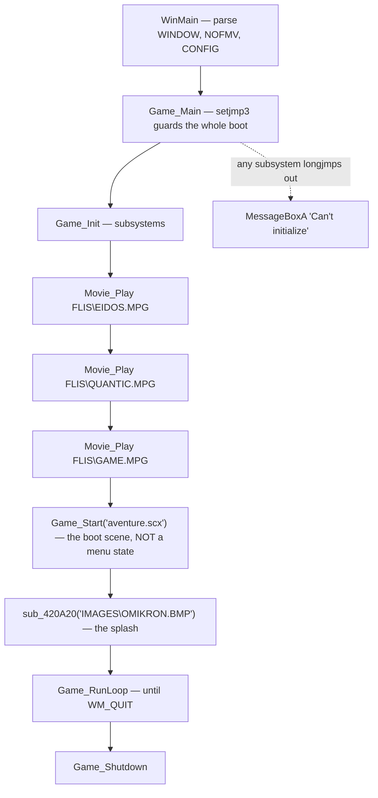

# 2. Boot, and the frame

← [The original](01-the-original.md) · [Contents](README.md) · next: [The data](03-the-data.md)

---

## In short

Between double-clicking the icon and the first frame of play, the engine does
four things: it starts its subsystems, plays three MPEG movies (the publisher's
logo, the developer's, and the game's own), loads a scene called
`aventure.scx`, and enters its main loop.

The thing worth knowing is that **there is no menu code**. The main menu you
see is `aventure.scx` — an ordinary scene, loaded by the same function that
loads a street or an apartment. What the player reads as "the front end" is the
same machinery as the rest of the game, so the boot path needs no special case
for it.

The second thing worth knowing is about time. The engine measures everything in
**frames at 30 per second**, not in seconds. If the game runs at 60 fps, one
tick of every clock in it is half a frame; at 15 fps it is two. And below 10
fps the game deliberately **slows down** rather than taking bigger steps.

That single division — thirty over the frame rate — is why every duration in
this repository is quoted in frames. It is not a convention anyone chose. It
falls out of one line of the original.

## In detail

Everything here is read from `Game_Main` (`0x00439470`), `Game_RunLoop`
(`0x00439310`) and `Game_Frame` (`0x0041F740`), with the constants read out of
the executable image itself rather than off the decompilation.
`verify.py: boot sequence` asserts them. Full account: [`docs/BOOT.md`](../docs/BOOT.md).

### The chain



`Game_Main` opens with `setjmp3`, and the `if` arm is the failure path. The
whole boot is one guarded block — which is why nothing inside it checks a
return value.

### The three movies, and the two different skips

`gamedata/FLIS/` holds exactly three files, plain MPEG-1, nothing to decode:

| file | bytes | dated |
|---|---|---|
| `EIDOS.MPG` | 5 714 716 | 28 Sept 1999 |
| `QUANTIC.MPG` | 10 265 108 | 28 Sept 1999 |
| `GAME.MPG` | 46 359 152 | 5 Oct 1999 |

They are also the first thing in the game that **cannot work without a
case-insensitive filesystem**: the executable spells them `FLIS\EIDOS.mpg`, in
lower case, and the disc ships `EIDOS.MPG` in upper. Not one of the three
uppercase forms appears anywhere in the image. Before any asset, before any
archive, the boot path already needs the behaviour that Win95/98 gave for free —
which is why the port's `DataFs` is a class and not a `fopen`.

**There are two skips, not one.** `Input_Poll`'s second out-parameter is 1 for
any key held and **2 for scan code 56**, which is left Alt. Any key ends the
movie playing; **Alt ends all three**, by setting a latch nothing ever clears.
The whole block is also skipped when the `NOFMV` command-line word is present,
or when the machine reports no movie playback at all.

Two details worth having if this is ever reproduced. The scan loop does not
break on a hit, so a key with a scan code *above* 56 held at the same time as
Alt overwrites the 2 back to a 1 — Alt+Shift skips one movie, Alt alone skips
three. And the same key that stops a movie is read again on the next
`Movie_Play`, so holding a key down skips all three by a different route from
the latch.

### `Game_RunLoop` — a Win32 idle loop

```c
while (1) {
    while (!PeekMessageA(&Msg, 0, 0, 0, 0)) {
        if (word_4E7694 && dword_52DD58 && !dword_52DD4C) {
            if (GetAsyncKeyState(27) & 0x8000 && !dword_4E9728)
                UI_LoadScreen(31, -1, -1);        /* the pause menu */
            Game_Frame(dword_4C5944, word_90EF2E);
            dword_4C5944 = 0;
        } else {
            dword_4C5944 = 1;
            WaitMessage();                        /* BLOCKS */
        }
    }
    if (!GetMessageA(&Msg, 0, 0, 0)) break;
    TranslateMessage(&Msg); DispatchMessageA(&Msg);
}
```

The frame runs only in the message pump's **idle** path, behind three gates:
the game is running, the app is foreground (`WM_ACTIVATEAPP`, stored straight
from `wParam`), and a third flag. Fail any and it calls `WaitMessage()`, which
blocks — alt-tab away and the process genuinely stops burning CPU.

`dword_4C5944` is what makes that safe. It is set on the way into
`WaitMessage`, cleared after every `Game_Frame`, and `Game_Frame`'s first act
when it is set is to re-baseline all three timers. **The idle gap is discarded,
not integrated** — without it, returning from a two-minute alt-tab would hand
the simulation a 120-second delta.

Escape is read with `GetAsyncKeyState` **directly in the loop**, not through
the input system, gated on the pause flag `Game_Frame` returns — so the pause
screen cannot reopen itself.

### Where "one frame" comes from

`Game_Frame` recomputes the delta every frame:

```c
flt_90E174 = 1000.0 / raw_ms;        /* this frame's fps            */
flt_90E170 = 1000.0 / smoothed_ms;   /* smoothed: (prev + raw) >> 1 */
switch ((int16_t)dword_4E972C) {
case 0: flt_4C30D8 = 30.0 / flt_90E170;
        if (flt_4C30D8 > 3.0) flt_4C30D8 = 3.0;   break;
case 1: flt_4C30D8 = 1.0;   break;   /* fixed deltas: frame-step  */
case 2: flt_4C30D8 = 0.5;   break;   /* and slow-motion modes,    */
case 3: flt_4C30D8 = 0.1;   break;   /* selected by dword_4E972C  */
case 4: flt_4C30D8 = 2.0;   break;
}
```

Case 0 is the answer. The delta is `30.0 / fps`, measured in **thirtieths of a
second** — one unit *is* one frame at 30 Hz. Every clock downstream is in those
units: the `.3DA` scene clips, the camera editings, the ambient-effect periods,
an object program's `obj+88`.

**The clamp is a gameplay fact, not a guard.** Capping the delta at three
frames means that below 10 fps the game slows down rather than taking longer
steps. A replica that integrates true elapsed time on a slow machine is not
more accurate — it is wrong.

Three overrides sit after the switch: a forced delta (ships off), an
**external-clock** path that replaces the wall clock with the advance of
something sampled where audio position would be — which is how a cutscene's
animation cannot drift from its soundtrack — and the pause, which forces the
delta to 0.0 and is what `Game_RunLoop` reads to gate Escape.

The first half of the function is shorter: re-baseline if resuming,
`Input_Poll`, compute the **edge-filtered** input word `a & (a ^ (prev &
prev2))`, and call `Game_Tick()`.

### The constants, read out of the image

| symbol | value | what |
|---|---|---|
| `flt_4BC1CC` | 30.0 | the numerator — the frame rate the delta is *in* |
| `flt_4BC1EC` | 1000.0 | ms → fps |
| `flt_4BC1F4` | 3.0 | the clamp |
| `flt_4C30D8` | 1.0 | the delta as shipped, i.e. 30 fps |
| `flt_4C30E8` | −1.0 | the forced-delta override, off |
| `flt_4BC208` | 10000.0 | where the free-running accumulator wraps |

### How the port does it

`build/omk gamedata --tables tables` parses the command line the way `WinMain`
does, steps the three movies, calls `Game_Start("aventure.scx")`, reads its
starting area from `IAM\START` +1414, and runs `Game_RunLoop`'s idle path.

The measurement that makes this more than a claim: its announcement stream
matches `traces/intro.log` — a capture of the **original engine** — **42 events
of 42, in order, from a cold start**, with nothing hand-wired. `verify.py:
engine boot`.

The two clock rules are ported as rules, not as constants, because both have
already caused bugs: an ambient-emitter period read as seconds ran a set **30×
too slow**, and a viewer that pre-sampled one entry per whole frame went black
on a fractional index. A live frontend must keep feeding the simulation
*frames*, however fast it presents.

## Where it lives

| | |
|---|---|
| findings | [`docs/BOOT.md`](../docs/BOOT.md) |
| the port | `engine/src/platform/boot.*`, `engine/src/platform/movie.*` (vendored `pl_mpeg`, MIT), `engine/src/platform/datafs.*` |
| checks | `verify.py: boot sequence`, `engine boot`, `engine movies` |
| a capture to compare against | `traces/intro.log` |

## What is not settled

* **`Movie_Play`'s decoder and its eight parameters are unread.** Nothing needs
  them — a replica hands three MPEG-1 files to any decoder — so it is recorded
  as deliberately unread rather than as a gap.
* **What the external clock actually reads** (`sub_42BC30`). "Audio position,
  on the evidence of where it is sampled" is a reading, not a result.
* **`dword_4E972C`'s non-zero cases** are clearly debug modes, but nothing
  observed has ever been seen to set it.
