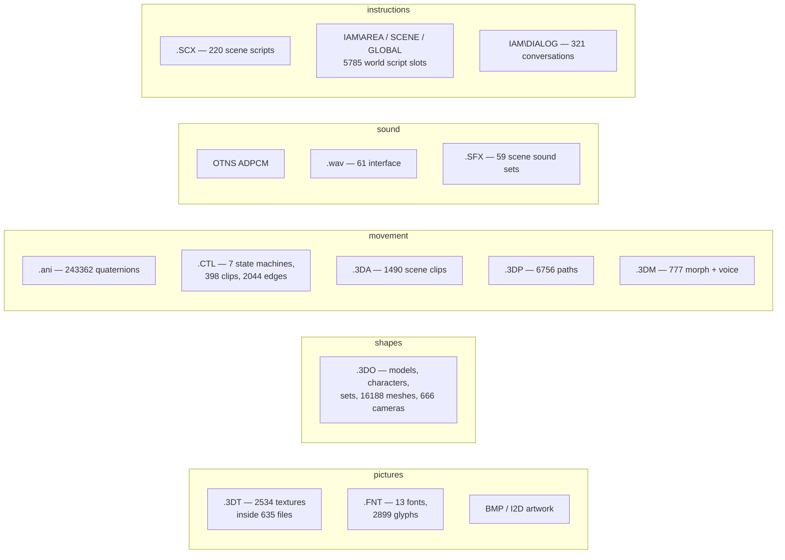

# 3. The data

← [Boot, and the frame](02-boot-and-frame.md) · [Contents](README.md) · next: [The script VM](04-the-script-vm.md)

---

## In short

The game is about 1.7 GB of files, and almost all of it is one of five things:
**pictures**, **shapes**, **movement**, **sound**, and **instructions**.

The instructions are the interesting part. The game's rooms, streets, doors,
conversations and cutscenes are not code — they are data, compiled by whoever
built the levels into a bytecode the engine interprets. Walking into a doorway
does not run a function called `enter_apartment`; it steps into a rectangle on
the floor that carries a pointer to a script, and the engine runs it.

The other thing to know is that **most "file formats" are not files**. The game
ships 635 model files, but 2 534 textures — because textures live inside the
model files. It ships 220 scene files, but 1 490 animation clips and 6 756
paths — because those live inside the scene files. Opening the folder and
counting extensions tells you almost nothing about what is in there.

## In detail

### The shipped tree

| directory | size | what |
|---|---|---|
| `MORPH/` | 1.0 GB | `.3DM` — facial animation and the voice audio that drives it, 777 files |
| `SCPTDATA/` | 236 MB | `.SCX` scene scripts (220) and `.SFX` scene sounds; the animation clips and paths live in their streamed blocks |
| `MESHES/` | 135 MB | `.3DO` models, characters and sets (635) with their `.3DT` textures (2 534) |
| `FLIS/` | 59 MB | the three MPEG-1 intro movies |
| `IAM/` | 17 MB | the archives — the world scripts, conversations, interface text, save directory, and the `.TAG` name tables |
| `VOICEOFF/` | 1.4 MB | `.ADP` voice-over, of which only 10 of 561 named ever shipped |
| `SOUNDS/`, `FONTS/`, `I2D/`, `IMAGES/`, `TRACKS/`, `ANIMS/`, `TRAJECTOIRES/`, `MAP2D/`, `RADAR/` | small | interface `.wav` (61), `.FNT` fonts (13), 2D artwork, `.ani` libraries, `.OPT` traffic circuits (6) |

`gamedata/IAM/FRENCH/` is a **byte-identical duplicate** of `gamedata/IAM/`
(same MD5) — not a second corpus, which was worth establishing once so nobody
treats it as one.

### The archives: `IAM`

`IAM` is the container format, and the mistake worth not repeating is assuming
everything in that directory is one. `IAM\AREA` and `IAM\SCENE` are archives of
numbered chunks. `IAM\GLOBAL` is **not** — `Global_Load` `fopen`s it as a plain
file with a fixed header, and parsing it as an archive loses 2 of 10 scripts
and 86 trigger sites. `IAM\START` is not an archive either; it is the
**new-game save file**, which `Game_NewGame` hands straight to `State_Apply`.

That table is worth reading as a whole, because it is the clearest example in
the repository of why a plausible parse is not a parse:

| found in the data | what the code said | cost of not checking |
|---|---|---|
| `SCENE` count looked like an int32 at +44 | `Scene_Load` reads an **int16** | 22 of 71 chunks silently rejected — 257 scripts instead of 605 |
| `IAM\GLOBAL` parsed plausibly as an archive | `Global_Load` **fopen**s it | 2 of 10 scripts, 86 trigger sites |
| `START` did not fit that header, so "different format" | it is the new-game **save** | "5016 scripts" reported from a section offset read as a count |

### The format families

### Established, and how

Every row below is asserted by a check; the "state" column is the standard from
[chapter 12](12-evidence.md).

| format | state |
|---|---|
| `.3DT` textures | 2 534 / 2 534 byte-identical |
| OTNS ADPCM | decoder transcribed from `sub_483200`; 777 / 777 sample-identical, 225 441 216 samples |
| `.3DM` morph — bones, face, root motion, audio | 777 / 777 files |
| `.3DO` meshes, characters and sets | records of 140 / 32 / 28 / 32 / 52 bytes, all 401 files walked |
| `.ani` animation libraries | 243 362 / 243 362 unit quaternions |
| `.CTL` state machines | 7 / 7 landing exactly on the file size; 398 clips; all 2 044 graph edges resolve |
| `.SCX` scene scripts | 220 / 220; chunk 2 lands exactly on the next chunk tag in all 220 |
| `.3DA` scene clips | 1 490 clips; root key 0 = the authored placement |
| `.3DP` paths | keys and facing convention closed; header u32 = duration, 6 756 / 6 756 |
| `.SFX` scene sounds | 59 / 59 six-section walk exact |
| `IAM` archives, `IAM\DIALOG` | solved |
| world scripts | 5 785 / 5 785 slots decode |
| the 8192-byte game state | walk lands exactly on 5 686; six counts against six independent sources |

### The self-checking parse

The invariants above are not decoration — they are the method. A parse is
trusted when the shipped data *could have failed it and did not*:

* the walk must land **exactly** on the file size;
* a shared pool must be consumed **in order with no gaps**;
* every cross-reference must resolve (the `.CTL` loader refuses to start
  otherwise);
* quaternions must be unit;
* two independent chains must agree — a conversation's model via the actor
  record and via the `.3DM` face-vertex count, 150 of 153;
* an accumulation must have the **right shape**, not merely a plausible total.

That last one is the subtle one, and it decided a real question. Two per-frame
`float[3]` tracks were read as deltas. The `.3DM` one was **refuted** because
integrating it walks every character off the map for ever. The `.3DA` root
track was **confirmed** because its integral converges — Kay'l's x climbs 0→117
over forty frames then sits flat at 110–118 for the remaining 230, which is a
man walking in and stopping. Read as absolute offsets, the same numbers never
leave ±2.3 and he never moves at all. **The discriminator is the curve, not the
endpoint.**

"It decodes without crashing" is not a check. Random bytes decode.

### How the port reads it

One rule, and it is architectural rather than stylistic: **all data access goes
through `DataFs`**, which resolves case-insensitively because Win95/98 did.
2 367 of 2 367 files resolve under four manglings of their path. Chapter 2
explains why this cannot be an afterthought — the boot path needs it before the
first asset is touched.

The inverse rule guards the other direction. `gamedata/` is input, and
`omk::safeOutputPath` refuses any output path carrying a shipped-data extension
or lying inside the shipped tree, and every tool in `engine/tools/` that takes
an output path calls it on each `argv` path it opens for writing — because on
2026-09-02 a 26 KB mesh
from the 1999 disc was truncated to an 8-byte header by a tool whose second
positional argument was its output. `verify.py` caught it — afterwards, which
is the wrong side of the event.

The guard keys on the file's **extension** and the tree's own subdirectory
names, never on the root's name. That is why renaming the data directory from
`fr/` to `gamedata/` in 2026-09-03 did not silently stop it guarding.

## Where it lives

| | |
|---|---|
| container formats | [`docs/FILE_FORMATS.md`](../docs/FILE_FORMATS.md) — IAM, DIALOG, VM, TAG, 3DM, 3DO, SCX, GLOBAL/START |
| asset formats | [`docs/ASSETS.md`](../docs/ASSETS.md) — ADPCM, .ani, .CTL, textures, cameras, sets, clip types |
| the port's readers | `engine/src/formats/` — 26 files, one per format |
| path resolution | `tools/omkpaths.py` (Python), `engine/src/platform/datafs.*` (C++) |
| byte accounting | `tools/chunkmap.py` — claims every byte a documented structure explains and reports the rest: **97 bytes left in 330 chunks** |

## What is not settled

* **97 bytes**, across 330 `IAM\AREA` / `IAM\SCENE` chunks, are not explained by
  any documented structure. `chunkmap.py` reports them rather than hiding them.
* **`.3DM`'s `float[3]` track.** The parser's integration of it is read and
  confirmed against the assembly, but the corpus refutes "root-motion deltas"
  as playable semantics — near-constant, near-unit in 57 of 60 files, which
  means universal drift. Whatever neutralises the integral in the engine is
  untraced.
* **`.3DM` node slots 0 and 1.** Uploaded with preamble ids 0/1, bound by no
  drawn mesh, not rotations, and **not the voice envelope** either. Eye-direction
  or blink channels are the surviving shapes.
* **One 32-byte field** of the save directory's 72-byte record.
