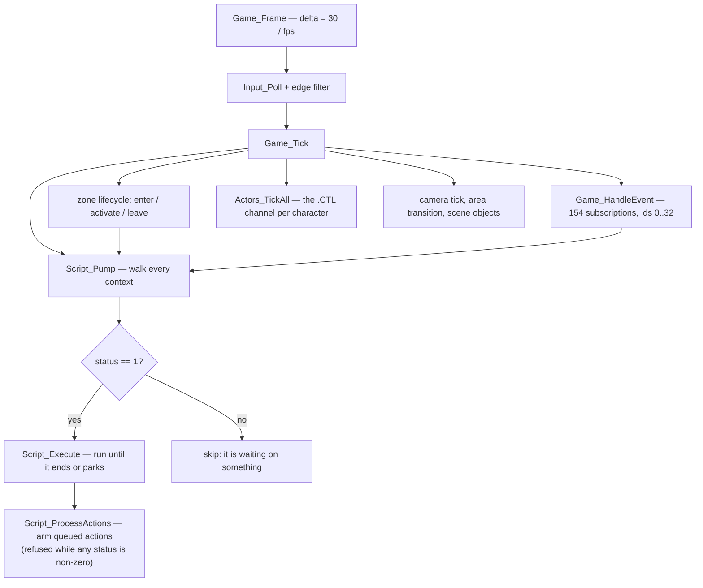

# 5. The world

← [The script VM](04-the-script-vm.md) · [Contents](README.md) · next: [Actors](06-actors.md)

---

## In short

The city is cut into **areas** — a street, an apartment, a rooftop. On top of
an area the engine can lay a **scene**, which is a set of events staged in it: a
cutscene, a conversation, an ambush. Two of each are resident at once, so
walking from one place to the next does not stall.

Inside an area, the floor is covered in invisible **trigger zones**: 4 558 of
them across the game. A zone is a quadrilateral, plus an arc saying which way
you must be facing, plus a pointer to a script. Walk into one facing the right
way and something happens. That is how nearly everything in the game starts.

Two things join them up. **Messages** — an area can subscribe scripts to
numbered events, so "the player was bumped" or "an object finished moving" can
be listened for. And the **game database**: 8 192 bytes that hold everything the
game remembers about you. That block *is* the save file, and the new-game state
is a save file too, shipped on the disc.

There is also a third way in, and it went unfound for a long time because
nothing enumerated it: **each chunk carries its own startup script at offset
+4**, run the moment the chunk loads. Entering the area *is* the trigger.

## In detail

### Areas, scenes, and the two resident slots

`IAM\AREA` and `IAM\SCENE` are archives of numbered chunks. `Area_LoadSet` keeps
**two decor sets resident** — state `2` linked into the render list, state `1`
loaded but unlinked. **Hidden is not unloaded**, and that has a visible
consequence the game shipped with; see [chapter 8](08-rendering.md).

`Area_TickLoad` hands the AREA block's `+4` and the SCENE block's `+4` to
`Script_NewContext` and queues each the moment its chunk loads — the context
stored back at block `+0`, which is why `+0` is zero on disk. **173 of 330
chunks carry a startup script, and all 173 disassemble clean.**

### The trigger zones

The 68-byte record, all 4 558 of them decoding with 0 bad:

```
 a quadrilateral on the floor    the area you must be standing in
 a facing arc                    which way you must be looking
 a save bit                      whether firing it is remembered
 a camera                        what watches you while it runs
 a script pointer                what to run
```

The lifecycle has three edges, not one — **enter**, **activate** and **leave** —
which is why a zone can start something when you walk in, something else when
you press the action button inside it, and a third thing when you leave.

Zone ids resolve through `IAM\ZONES.TAG`, which is how a listing can print
`ZONES[2027] = 'Dialogue Savant'` rather than a number. Every `.TAG` domain
works this way; they are the level designers' own names, shipped.

### Messages

`Game_HandleEvent` is the switch. 154 subscriptions across the game, ids 0..32.
A subscription is an 8-byte record; the count is at chunk `+86` and the table at
`+68`.

That `+68` is worth a paragraph, because it is the repository's best example of
a right answer reached for a wrong reason. A capture of the game's opening
logged conversation 272 and two cameras that **no script slot could emit**. The
bytes were found at the offset held in `+68`, and `+68` was therefore read as a
script pointer. It is not — `Message_RunHandlers` reads it as the subscription
table. Chunk 118 declares **0 zones and 0 subscriptions**, so both walks are
right to find nothing, and the empty table's base coincides with the start of
the code after it. `+4` and `+68` are the same number, 1040, for that chunk
alone. It looked like a coincidence because it was one.

### The 8 192-byte game database

Everything the game remembers. The walk over it lands **exactly** on 5 686
bytes of documented structure; six independent counts agree with six
independent sources; **0 spare bits are set**; and `State_Apply` ↔ `State_Save`
round-trips.

`IAM\START` is the new-game save — not an archive, not a script container. That
was established the hard way: it did not fit the archive header, was written off
as "a different format", and a section offset read as a count produced a
reported "5016 scripts" that do not exist.

`IAM\GAMES` is the save directory: 3 496 bytes of header, then 256 slots of
32 808. The 256×72 directory record is established from `SaveDir_Build`.

The clock is a **41-day calendar**, ported with the rest.

### Putting it together — a frame



### How the port runs it

`engine/src/script/area.cpp` and `area.h` are the **Session**: the resident
slots, the transitions, and the frame. `zones.*` is the zone registry;
`world.*` the zone harness; `gamestate.*` the database; `savefile.*` and
`globaldata.*` the persistence.

Two results anchor it. The world scripts execute over **5 958 slots** with the
resulting database **byte-identical** to `tools/sim`, the independent Python
implementation. And the golden traces — five captures of the original engine,
1 315 events, 112 anchors — replay with the port agreeing with `tools/sim`
everywhere; the port in fact **closed one of the reference implementation's six
disagreements** by modelling `ui.open`'s park.

## Where it lives

| | |
|---|---|
| findings | [`docs/FILE_FORMATS.md`](../docs/FILE_FORMATS.md) (containers), [`docs/GAME_STATE.md`](../docs/GAME_STATE.md) (the DB, START, the save, the clock) |
| the port | `engine/src/script/area.*`, `zones.*`, `world.*`, `gamestate.*`, `savefile.*`, `globaldata.*`, `objects.*` |
| the reference | `tools/sim/world.py`, `tools/sim/scene.py` |
| byte accounting | `tools/chunkmap.py` |
| checks | `verify.py: startup scripts`, `world scripts`, `zones`, `game state`, `trace agreement` |

## What is not settled

* **97 bytes across 330 chunks** are unexplained (chapter 3).
* **What orders a scene's beats was closed; what starts the other 105
  conversations was not.** Across all 173 startup scripts, the only
  `dialog.start` not already reachable from a script slot is 272 itself — one,
  not a hundred. Chapter 13 lists everything ruled out.
* **`Actors_SpawnFromTables` is not ported**, so in the replica the world's own
  ambient characters never spawn; only the ones a script names with
  `character.show` appear. This is the largest single gap in the port.
