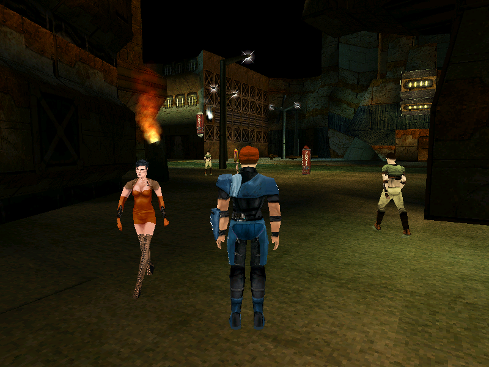

# 6. Actors

← [The world](05-the-world.md) · [Contents](README.md) · next: [Conversations and cutscenes](07-conversations-and-cutscenes.md)

---

## In short

Every character in the game — the one you steer and the ones you do not — is
run by the same machine: a **state graph read out of a data file**. Standing,
walking, running, drawing a weapon, climbing, swimming, being hit: each is a
node, and the arrows between them carry the button combinations that take you
along them.

Because the graph is data, the game can hand you a different body and keep
going, which is the whole premise of *Omikron*.

Sitting above that graph is a shorter list of **18 modes** the engine itself
knows about — on foot, in water, riding, in a fight — and under it is a
**walker** that decides whether the ground in front of you is a step you can
climb, a slope you can walk, or a drop you will fall down.

The city's crowd is a third thing again: not scripted characters but a
**circuit** of lanes shipped in a data file, with pedestrians spawned onto it
in proportion to a menu setting, following, overtaking, queueing at junctions
and stepping around you.

  
   <em>Drawn by the port: Kay'l in Anekbah, with the crowd on the circuit around him. Everyone here is the same state machine reading the same kind of file.</em>

## In detail

### The `.CTL` channel

Seven `.CTL` files ship, and each is a state machine. All seven walk to
**exactly** the file size; 398 clips; **all 2 044 graph edges resolve**, which
is not a nicety — the loader refuses to start otherwise.

The format is fully read, and every flag-gated block has its traced consumer:

| block | consumer | what it carries |
|---|---|---|
| combat | `Fight_ResolveHit` | damage, hit window, reaction by low-16 id, knockback |
| turn / root shift | `Cef_ApplyTurn`, `Cef_ApplyRootShift` | two modes each — over-the-window and on-transition, which are the two bits of `0x140` / `0x280` |
| move name | `Cef_QueueSpecialMove` | into the binary's own 66-row `tab_special_move[]` of engine callbacks; **209 / 209** shipped sites resolve |
| bit `0x20` | — | the group's default entry (202 / 202) |
| bit 2 | — | redirect through GoTo |
| `+28` sub-records | the states' **effect records** | bone-attached sprites and frame-triggered sounds, footsteps included; all 590 decode |

The transition model is read too: input-bitfield matching, cancel windows,
priorities, group-global edges.

A caution attaches to the priority rule, and it is a model of the kind of
honesty this repository tries to keep. Of 9 103 gated transitions, 120 are a
real priority contest, and in **0** of them is the first match not also of
maximal priority — so a plain first-match rule changes not one of 12 063 edges.
**The rule stands on `Cef_FindTransition`'s code; the corpus is silent.** A
corpus test that cannot separate the rule from a simpler one is not evidence
for the rule.

### `ACTOR_STATE` — the 18 modes

Mapped 0..17, and **run** rather than merely described. Three findings from
running it:

* **14 is the water state** — `RSTNAGE` and `MDDIVEND` write it.
* **7 and 8 are the mount and the ride** of one slider; `MDSLIDOU` refuses to
  dismount from anything but 8.
* **7 has no case in `Actors_TickAll` at all**, which is the kind of asymmetry
  you only find by building the machine.

### The walker

30° slope limit, 30 cm step height, and tiered falls. It is what turns "the
player pressed forward" into a position, and it is the subsystem most
thoroughly corrected **by playing rather than by testing** — two examples
recorded in `todo/omk-play.md`:

* the walker **had no way down**: every raised surface in the game was one the
  player could never leave, and a face past 30° was treated as a hole rather
  than a slide;
* a transition could leave the active row and the linked decor disagreeing,
  which draws a black world with the crowd still walking in it.

Neither is visible in any check that looks at one state at a time. Both are
obvious in five seconds of play. Chapter 12 makes the general case.

### Combat, and the AI that plays it

The combat block is fully decoded. The **fight AI** lives in the `.CTL` at
`+76` / `+80`: four difficulty profiles, each a set of button combinations
**injected into the player's own input queue**. Harder profiles wait less
between combos. The union of input bits they use is `0xCFF`.

That is worth dwelling on as a design: the AI does not have a separate
movement system. It presses buttons.

The **shoot AI** picks one of four callbacks by character type, from the
binary's own 14-name type table. The shipped split over 306 resolved
`shoot.actor.enter` sites is **302 generic / 3 Astaroth / 1 Gandhar / 0
X-Tech** — and **no character in the game is type 7 at all**, so one callback
is unreachable.

Gandhar is the exception that corrected a documented claim. "The shoot AI has
no data table behind it" was true of the *dispatch* and false of the *AI*: he
plays three compiled behaviour scripts — healthy, wounded ≤100, critical ≤50 —
through two 12-entry handler tables, all chaining end to end at `0x004CFA30`.
That error survived in three documents, which is why [chapter 12](12-evidence.md)
insists a tier is declared in three places.

### The street: sliders, and what they carry

Established 2026-09-03/04, in [`docs/STREET_LIFE.md`](../docs/STREET_LIFE.md).
Three mechanisms make a city street look inhabited, and only one of them is
scripted:

**1. The `.OPT` traffic circuit.** Six files, 7 blocks each, 6 / 6 walking
exactly. It is a network of lanes, routes, junctions and action points.
`Slider_Init` spawns pedestrians onto it at `39 × (5 − density) × h[3]` — the
density being the options-menu setting, so **the crowd size is a menu row** —
and `Sliders_Tick` walks them: lanes, routes, following, overtaking,
reservation groups, action points.

**2. The road traffic**, on the same circuit's vehicle lanes, behind the AREA
masks at `+172` / `+174` (int16, and nonzero in exactly the three areas that
have vehicle lanes). Spawned by the walkers' own code at `39 × h[4]` with **no
density factor**, capped at a 40-slot ride pool, driven by the walkers' own
mover step and gait with the vehicle thresholds 195 / 390. Qalisar's slider
mask of 1 is the reserved row alone, so all 40 of its vehicles are motorbikes.

The port puts vehicles in the **same pool** as walkers, and that is not
tidiness: 70 of Anekbah's reservation groups are reachable from both classes,
and a vehicle waits on a walker **2 197 times in 1 800 frames** — 0 with a
counter per class.

**3. The authored extras** — 621 `scx.play.actor` sites, characters a scene
program places and animates.

Over all of it sits the **spatial index**: spheres for actors, an ellipse for
walkers, producing the crowd push and the bump and talk messages, plus the head
look that turns a passer-by's head toward you.

## Where it lives

| | |
|---|---|
| findings | [`docs/ASSETS.md`](../docs/ASSETS.md) (`.CTL`, clips, special moves), [`docs/STREET_LIFE.md`](../docs/STREET_LIFE.md) (the crowd and the traffic) |
| the port | `engine/src/actor/` — `channel.*` (the `.CTL` machine), `state.*` (`ACTOR_STATE`), `walk.*`, `player.*`, `shoot.*`, `pose.*`, `speaker.*`, `pedestrians.*`, `spatial.*`, `vehicles.cpp` |
| lifted tables | `tables/special_moves.json` (66 rows), `tables/shoot_ai.json` |
| checks | `verify.py: engine actor states`, `ctl channel`, `pedestrians`, `city crowd`, `crowd push`, `head look`, `road traffic`, `street frame` |
| to watch it | `build/omk-play … --save ../traces/save-appart.bin --area 0 --stand 1804,0,-6890,336 --density 4` |

## What is not settled

* **The `.CTL` channel has no oracle, and cannot have one from this rig.** This
  is stated plainly rather than glossed: the golden-trace logger sees only what
  a VM handler narrates, and combat has two opcodes — `fight.begin` announces
  nothing, and `player.become` announces to a domain the logger filters.
  `Fight_TickAI`, `Fight_ResolveHit`, the 18 `ACTOR_STATE`s and the transition
  matching are native code and never touch it. A capture **did** reach combat —
  32 of its anchored scripts carry `fight.begin` — so the silence is the
  mechanism, not the play. The channel's standard is therefore
  **data-constrained** (12 063 edges, every one re-derived from the file), not
  engine-verified. The general lesson: *check whether a subsystem announces
  before asking anyone to capture it.*
* **Astaroth's and the generic shooter's per-state geometry** are ported as
  state graphs only.
* **Not ported**: the player's ride (`Slider_TickRide`, `ACTOR_STATE` 7/8), the
  engine's LOD selection among an actor's four skeletons (the viewer draws the
  first), the bump's `camera.shake`, and the joystick axes (carried, but nothing
  steers with them yet).
* The crowd **density is held at the engine's default 3** until the options menu
  hands its value in.
