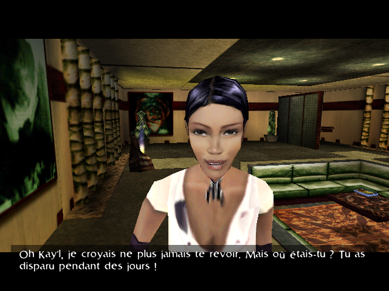
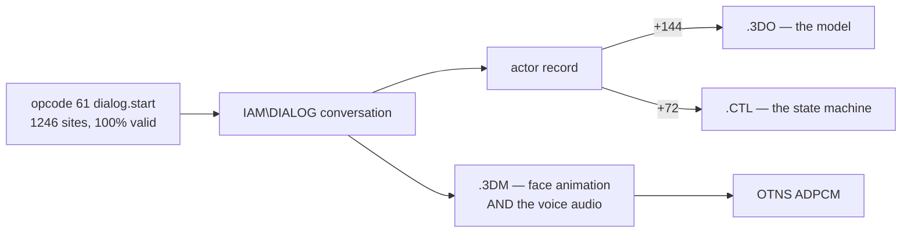

# 7. Conversations and cutscenes

← [Actors](06-actors.md) · [Contents](README.md) · next: [Rendering](08-rendering.md)

---

## In short

A conversation is a tree. Each node is a line somebody says; each branch is a
reply you can pick. Every branch carries two little programs: one that decides
whether the reply may be *offered* at all, and one that runs if you *choose*
it. That is how a conversation remembers that you already have the astronomy
book.

While it plays, the game does four things at once. It shows the text. It plays
the recorded voice — and the character's **face is animated by the same file
the audio is in**, so the mouth cannot drift from the words. It poses the body
from an animation clip. And it flies a camera.

  
   <em>Conversation 402, captured from the original engine: the set, the posed speaker, the camera, and the subtitle, all four running on different clocks.</em>

A cutscene is the same machinery with nobody to talk to. Two families ship: one
where a scene script animates the characters and a separate **camera editing**
cuts between shots, and one that is nothing but a camera flying through a set —
the game's 145-second title sequence is the second kind.

The detail that catches every reimplementation is that **these run on different
clocks**. A line is timed by its audio. A standalone animation clip has no
audio and runs on its own 30 fps loop. The camera move runs on a third clock
tied to the line — because driving it from the body's frame makes a looping
animation drag the camera back to the start of its move.

## In detail

### The conversation format

`IAM\DIALOG`, 321 conversations, solved. A node carries eight script pointers,
and which four are which was **proven by tracing** rather than guessed:

| | fired when | reads | function |
|---|---|---|---|
| `ptr[0..3]` | `Dialog_TickUI` builds the reply menu (event 55) | **evaluates** for a value | `Dialog_EvalBranchCondition` — the conditions |
| `ptr[4..7]` | a reply is chosen (event 59) | **executes** in a throwaway context | `Dialog_GetBranchAction` — the actions |

That is the [chapter 4](04-the-script-vm.md) dry-run/execute split doing real
work: the same VM, the same handlers, one pass that consumes operands and
returns a value and one that acts.

### Getting from a conversation to a face

The chain is worth writing out, because three independent files have to agree:

The actor table was found by noticing model-shaped strings in a 276-byte array
that "held no bytecode, so was not interesting" — and confirmed when
`Actor_FindById` turned out to scan exactly it. The cross-check that the chain
is right: a conversation's model, resolved via the actor record, agrees with
the model resolved via the `.3DM`'s own face-vertex count in **150 of 153**
cases.

### The dialogue runtime

UI phases 1–8 are read. Three findings that a plausible implementation would
miss:

* **The pose rule.** `player.anim.hold` / `player.anim.release` — corpus-exact.
* **The line's two-sided fade.** A line fades into and out of the idle over
  `min(30, frames / 4)` frames, as a k/256 slerp, read from the morph player.
* **A line's root rotation is applied.** The engine's identity-key write misses
  — its root track index is only ever −2 — and the visible result is the
  whole-body bow.

### Staging: where the speakers stand

This is the part of the repository that has been wrong the most times, and each
correction is instructive.

There are **two** body-animation functions, and they place a character
differently:

| | uses | places the character |
|---|---|---|
| `Script_SelectBodyAnimation` (`0x02000004`) | 545 sites | snaps to the clip's **root key 0**, then adds per-frame deltas; a loop wrap applies nothing, so the accumulated offset stands |
| `Script_SelectRelativeBodyAnimation` (`0x0200002A`) | **2 398 sites** | never reads the clip root — it samples an authored **`.3DP` path** named by parameters 7/8, minus an inch offset in 9/10/11 |

For conversation 401 the difference is **365 units**. Both root readings were
wrong for it; key 0 was merely less wrong.

And for conversation 387 — lunch in the restaurant — the fix was that key 0 is
where a character stands **before sitting down**, since 387's clips are
sit-down animations. The tell is exact: Kay'l's key 0 sits 41.7 above the
restaurant floor, where his model's own standing pelvis-to-feet distance is
41.8. The clips then drop the root 17.3 and 19.1, onto the stools.

Conversation 402 — the apartment, pictured above — moves its roots 1.0 and 2.0,
so it looks right under *either* reading and could never have caught the error.

**How the error was caught is the point.** Every number this repository could
compute agreed with itself through two earlier fixes, and `verify.py` passed
each time. One frame of the running game showed it in a second. A suite that
only compares this repository to itself cannot see a wrong reading applied
consistently — and the sequel makes it twice over, because the fix that frame
produced was then over-generalised from one confirmed case to the whole corpus
and shipped as "solved", which broke 401. **One play-test is one data point.**

### Cutscenes: two families

**SCX programs plus chunk-10 editings.** 29 scenes, 125 shots, and **24 112 of
24 112** frames sample. The scene object's program animates the characters; the
chunk-10 *editing* linked to it cuts the camera between shots.

**World-camera scripts with no editing at all** — 106 of them, the game's
145.7-second title sequence among them.

What starts a cutscene's beats was an open question for a long time and is now
closed: the SCENE chunk's own `+4` startup script. For the Impasse, the engine
loads SCENE 55 over AREA 222, and SCENE 55's `+4` script at offset 1212 fires
all **sixteen** beats in the authored order the names always implied, then hands
off with `scene.load(237, 57)`. Nineteen of its 21 announcements appear in a
capture of the original engine, **in order**.

Why it stayed open is the lesson, and it is not "we looked in the wrong place":
every ruled-out route was correctly ruled out. **The inventory was
incomplete.** The 5 785 script slots come from zone records and message
subscriptions, and nothing in that walk reaches `+4` — so "no shipped script
starts them" was really "no script I enumerate". A negative result over a
corpus is only as strong as the enumeration behind it.

**The seventeen scene functions all run** (`todo/omk-play.md` 71, closed
2026-09-05). Eleven did nothing in the port until this month, and 102 of the
220 scenes use at least one: `Script_StopSound` (86 sites), the sprite family
— `Script_Display3DSprite` (232 sites in 65 scenes) and its five setters — and
`Script_ScaleObjectX/Y/Z` (35 sites, all the apartment's transfer tube). Two
readings worth carrying: a scripted sprite is placed at the **active camera's
target**, because the XYZ table the handler prefers has no writer anywhere in
the listing, and it is **never unlinked** once shown; the tube's beam grows
along Y by a scale in the node's own axes, ahead of its rotation
(`verify.py: engine scene sprites`, `engine node scale`, `engine stop sound`).

Two things about **timing** were settled by a reader's frames of the original.
A scene actor is untouched until his program's first *body-animation* step
runs: Impasse's arrival opens with a 60-frame wait, during which the engine
has Kay'l parked 500 units under the alley, where the port used to snap him to
his jump clip's first key at frame 0 — visible, motionless, inside the portal
(`verify.py: engine arrival wait`). And a set piece's records sit in the frame
of what the piece is **linked** to (`sub_450330`): the portal's two rings of
dark stars hang on a one-record row whose heading the engine never defines —
`sub_450940` zeroes it and then falls through to compute it from the record
past the block — so the port draws no ring on such an anchor. That one is a
**reconstruction**, settled by the capture rather than computed
(`verify.py: engine linked rings`).

### The clocks, and the traps

Four things that caused real confusion while building the viewers, all fixed:

* **Three clocks**, as in the summary above.
* **Animation key 0 is a rest sentinel, not frame 0** — a track holds
  `frames + 1` keys. Reading it as frame 0 puts a one-frame T-pose in every
  loop.
* **The clocks are floats.** A viewer that pre-samples one entry per whole frame
  must floor the index *and* interpolate between neighbours — but never across
  a cut, where blending slides the camera through a hard change for a frame.
* **Angles wrap, and angles flip.** A roll stored near 4096 (the format is
  4096 per turn) is a small *negative* one: identical standing still, a full
  turn once interpolated. And since the world-to-viewer map negates one axis, it
  is a *reflection*, which reverses the sense of every rotation — so a camera
  roll must be negated when it leaves the game's space. That one mirrored 2 725
  of the title sequence's 4 370 frames until 2026-08-29.

The general form of all four: **a value verified standing still is not verified
moving.** The invariant has to be written over the transition — *no camera move
may roll past 90°* (0 of 638 do), *every frame at half-frame steps must resolve*
(24 112 / 24 112). Write those and the class of error closes; otherwise it is
only found by watching.

## Where it lives

| | |
|---|---|
| findings | [`docs/FILE_FORMATS.md`](../docs/FILE_FORMATS.md) (DIALOG, the two placement functions), [`docs/CUTSCENES.md`](../docs/CUTSCENES.md), [`docs/ASSETS.md`](../docs/ASSETS.md) (staging) |
| the port | `engine/src/script/dialogue.*`, `scenerunner.*`, `program.*` (the seventeen scene functions), `scenehost.*`; `engine/src/actor/speaker.*`, `pose.*`; `engine/src/o3de/camedit.*`, `setpiece.*` |
| to watch it | `python3 tools/omkweb.py` → `/dialog` and `/cutscene` |
| staging under test | `tools/stagecheck.js` runs the page's own `stageMatrices` under node and asserts over the **transitions**; `tools/stagerender.py` draws the result |
| checks | `verify.py: dialog staging`, `dialog staging sweep` (--slow), `cutscene frames`, `impasse beats`, `engine scene sprites`, `engine node scale`, `engine stop sound`, `engine arrival wait`, `engine linked rings` |

## What is not settled

* **105 of 321 conversations have no known launch path.** See
  [chapter 13](13-open-questions.md) for the full list of what has been ruled
  out — it is long, and it is why the remaining possibilities are "outside the
  data" or "cut content".
* **The web viewer stages relative-path speakers wrongly** — a known TODO, not a
  finding in doubt. `omkdata.scene_idle` looks only for the `0x02000004`
  variant, so for a conversation using the relative one it guesses the clip and
  stages from the clip root instead of the path.
* **What `Anim_RootDelta`'s optional 3×3 is for**, on the scene path. It is
  answered for the *actor* path: a `.CTL` clip's root keys are in the
  character's frame and turned into the world by his facing matrix. The scene
  path stays as recorded.
* **The voice-over audio largely does not ship**: `media.play` names a `ZVO`
  object whose stem is a `VOICEOFF\*.ADP`, and **10 of 561** are on the disc.
  That is a property of the data, not a gap in the reading, and it is asserted
  so it stays explained.
* **A ring on an undefined anchor is a reconstruction.** The engine's heading
  for a one-record row is stack garbage by construction; that the original
  shows no ring is the capture's word, not a computed value. And **none of the
  seventeen scene functions' new arms is confirmed in play yet**.
