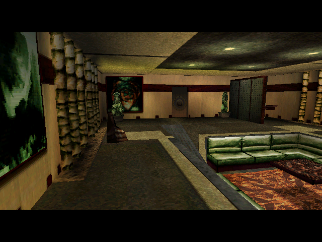

# 8. Rendering

← [Conversations and cutscenes](07-conversations-and-cutscenes.md) · [Contents](README.md) · next: [Audio](09-audio.md)

---

## In short

The picture is built in two layers. Underneath is the **3D scene** — the set,
the characters, the effects — drawn through Direct3D in 1999. On top is a **2D
display list** called I2D: the menus, the subtitles, the inventory, the
letterbox bars. The 2D layer is just memory copies, so it can be reproduced
exactly; the 3D layer went through a graphics driver, so it cannot.

The framebuffer is **16-bit** — five bits of red, six of green, five of blue.
That is not a detail. A replica that renders in 24-bit fails a comparison
everywhere for a trivial reason, and a captured frame's 8-bit values are the
*capturing host's* expansion rather than the game's data. Comparisons are made
in 16-bit, always, by bringing the capture down to the framebuffer's space and
never the other way.

The engine's own decisions about what to draw are surprisingly compact. One bit
test decides whether a mesh is drawable at all. One 14-bit number decides the
order everything draws in — and its **low six bits are the texture**, which
turns out to explain a visual oddity the game shipped with.

<p align="center">
  
  
  <br><em><b>Left:</b> the original engine's framebuffer. <b>Right:</b> the port's software rasterizer,<br>same set, same camera. The port draws the set; the capture also carries Telis,<br>the props and a subtitle — which is exactly what the comparison is built around.</em>
</p>

## In detail

### What is drawable

One test: `flags & 0x800043`. That single expression replaced three separate
heuristics in this repository's viewers, and **disagrees with them in both
directions** — it draws things they skipped and skips things they drew.

### The bucket key, and the texture in its low bits

Every draw is filed under a 14-bit key that decides its bucket and therefore
its order. `Raster_DrawTriangles` binds `g_D3DTextures[key & 0x3F]` — **the
texture is the low six bits of the key and nothing else.**

Those six bits are the material's slot at `+64`, a field that ships as `−1` in
all 2 534 materials because the loader writes it at load time.
`Tex3DT_BindMaterials` hands out **58** slots (`SetMaterialsMemory(58, 0)`, the
binary's own name) from a **global** pool, matching on the **19-character
texture file name alone**. On a hit it seeks past the file's own pixels and
points the material at what is already there.

### The consequence: Anekbah's wrong signs

Combine that global cache with the fact from [chapter 5](05-the-world.md) that
**two decor sets stay resident** — hidden is not unloaded — and you get a
shipped bug that has puzzled players:

> **182 texture names ship with different pixels in different `.3DO` files.**
> All twenty of Anekbah's are among them, colliding with `AToit`, `AImpasse`,
> `A_shootg` and `Qalisar` — Anekbah's own neighbours.

So the shop signs in Anekbah depend on **which way you walked in**. An incoming
set cache-hits against the outgoing location's atlases, and since the alternates
are *revisions* rather than different images, a substitution repaints some
adverts on an atlas and leaves the rest — neighbouring panels disagreeing, which
is exactly the reported symptom.

This was found by reading the renderer, and then **rendered and confirmed**:
same set, same camera, only the resident neighbour changing. `AImpasse`
substitutes 7 atlases and moves 6 920 frame pixels; `AToit` substitutes 18 and
moves **121 588**. A golden trace taken before any of this was known lands on it
— `traces/impasse-walk.log` announces `AREAS 222` then `AREAS 0`, walking the
player out of the Impasse into Anekbah with the Impasse's set still resident.

Note which side that puts in the wrong: **the viewers are right and the game is
the odd one out.** "Fixing" a viewer would mean reproducing the cache, not
correcting a decode.

### Transparency is two blend modes, not one

| mesh flags | mode | meshes |
|---|---|---|
| `0x1000 \| 0x2000` | additive | 211 |
| `0x1000 \| 0x4000` | multiply | 6 |
| `0x800` | cutout (the `SetRenderState(27, 1)` path) | — |

No mesh asks for either blend without `0x1000`.

Sprites take the same two buckets through the instance's mode — 4 is additive
(key `0x2100`), 6 multiply (`0x2200`) — and the multiply is `dst × (1 − src)`,
which darkens where the sprite is bright: the Impasse portal's black core is
twenty-two of those stacked (`docs/ASSETS.md` §3b). One more decision worth
knowing when a video of the original looks smoother than the port: the device
init asks Direct3D for **point sampling** on every texture stage
(`sub_4638C0`, stage states 16/17/18 = 1), so the port's blocky sprite edges
are the engine's own and a capture's soft ones are its driver's
(`todo/omk-play.md` 76).

### Colour, not brightness

The sets are shaded by a **colour** baked into every vertex. The engine copies
the whole dword at vertex `+28` into the `D3DTLVERTEX`, and
`Raster_DrawTriangles` declares `D3DFVF_DIFFUSE` in both its `DrawPrimitive`
calls — so the baked dword is a `D3DCOLOR` and reaches the screen in colour.

Reading only the green byte, as a well-known reference importer does, renders
every set in monochrome. **38.9% of set vertices are not grey.** This
repository shipped that bug itself until 2026-08-29 and keeps it as a
selectable mode in the viewers purely so the two can be compared on one frame.

The engine *does* contain a luma-to-grey conversion, and it is in a **second
render bank**: six two-entry arrays swapped by `sub_42FA00(bank)`. `Game_Init`
installs bank 0; **VM opcode 150 installs bank 1**. Bank 1 is the same
0x4000-bucket walk of near-identical length — 660 lines against 659 — differing
only in converting every vertex colour to luma. Fourteen shipped installs, all
bracketing runs of camera and fade opcodes: **the game has black-and-white
cutscenes**, and nothing about ordinary play's colour depends on it.

### Mirrors

Mesh flag `0x100000`, **6 of 12 203 meshes**, one live at a time. `sub_440D90`
reflects the camera through the mirror's plane and calls the scene draw again —
a **second full pass**, with screen X flipped, gated on the display driver index
so it is hardware-mode only.

This was found by a reader flying the viewer, and it **refuted** a documented
claim that "a mirror is a darkening overlay". Two parts of the port's version
stay reconstruction and are labelled as such: how the engine confines the
reflection to the mirror's area (its X flip is global; no clip or stencil step
was traced) and the plane's normal (the engine reads a runtime value, so the
port takes the face's cross product). Both were **confirmed by playing** — flown
across viewpoints the mirror is correct and its edges line up, which is the only
thing that can settle a plane, a normal's sign or a flip. Each of the three
looks plausible from one still frame.

### The 2D layer: I2D

A **16-layer display list** with 7 primitives and their pools (plus 2 calls that
do nothing, without which the 4 862-node cap does not add up), a DirectDraw
colour-key back end, a bitmap cache, and four flag families.

Two behaviours that a straightforward reimplementation gets wrong:

* the per-layer cache is a **head** cache, so within one layer everything after
  the first draws in **reverse submission order**;
* the blits **do not test the source Y**.

### RGB565, and how comparisons are made

Measured from a captured frame: the red channel carries **32** distinct levels,
green **63**, blue 25 of a possible 32, with gaps of 8 and 9 in the 5-bit
channels and 4 and 5 in the 6-bit one — the signature of a 5/6-bit value
expanded by bit replication.

And the rule that follows: **bring the capture into the framebuffer's space,
never the framebuffer into the capture's.** Expand a reference frame to 24-bit
and the menu's title region matches 94.9%, every difference an artefact of the
host's expansion. Quantise the capture back to 16-bit instead and it matches
**66 560 of 66 560**.

### How the port does it

The load-bearing design decision is that **the renderer boundary is at the
decision level, not the API level**:

```
    begin(view)                 the camera and its frustum
    submit(draw)                {bucketKey, mesh, range, blend, cutout}
    submit2d(I2dList)           the display list, already ordered
    end() -> Frame              RGB565, 640x480
```

**A backend receives decisions and turns them into API calls. It never makes
one.** Put the boundary at the Vulkan level instead and the ported decisions
leak into API-specific code; the software backend then cannot be added without
extracting them again, and the frame oracle becomes unusable.

Behind it sit two implementations: a **software rasterizer** — textured,
vertex-coloured, z-buffered triangles into an RGB565 framebuffer — and a
**Vulkan backend** (MoltenVK on macOS) that presents directly, with a GPU
stencil for the mirror. They agree on coverage to **0.995**, and the boundary
itself moves **0 pixels**.

The software rasterizer is **not a port**, and says so in its own header: the
engine has no software 3D path, D3D drew every triangle. It is a reference
implementation standing where D3D stood. What *is* ported is everything on this
page above it — the mask, the key, the cache, the blend modes, the visible-set
walk.

Since 2026-09-05 the same path also draws what the **scene scripts** put up:
`Script_Display3DSprite`'s instances through the particle geometry with the
instance's own frame, two scales and roll; a `Script_ScaleObjectX/Y/Z` scale in
the mesh patch that also moves the scripted doors and crates — and that patch
reads **both** resident pools, since a transition's door closes from the
outgoing one (chapter 5).

### What the frame comparison establishes, and what it does not

For **one camera** — the set of conversation 402 through camera 4555 — the
render reaches **tier 4** against the original engine's own framebuffer:

| metric | render | chance floor |
|---|---|---|
| edge alignment, two parked captures | 0.73 / 0.83 | 0.27 / 0.30 |
| holes falling where the capture is black | 92% / 99% | 33% frame-wide |

Four mid-sweep captures of the same set with the camera elsewhere reach only
0.14–0.38. The mirrored reading lands at 0.18 — **below its own floor**.

And the limits are stated as loudly as the result, because that is the house
rule: **one camera in one set is not a claim about the renderer**; the render
has no characters or props and the metric is *built* so it cannot see that; **no
pixel's value is checked at all**, so filtering, dither, fog and the blend
arithmetic keep no reachable tier; and the drawable mask is not exercised,
because both rules select the identical 10 257 corners of this set.

Per-pixel comparison is not merely unattempted, it is **refuted by the capture
itself**: between two frames of the same *parked* scene, 42% of pixels differ by
≤8, which is low-bit noise, while 17% differ by ≥32, which is the character
animating.

**And the one-camera limit bit within hours.** The rasterizer had no near-plane
clipping at all — a triangle with any vertex behind the cut was dropped whole,
so a floor or a wall with one corner behind you vanished while still in shot.
Through camera 4555 the fix changes **0 pixels**, because every triangle it
rescues there is off the edge anyway. Nothing in `verify.py` saw it. A player
flying the scene viewer saw it in one session.

## Where it lives

| | |
|---|---|
| findings | [`docs/ASSETS.md`](../docs/ASSETS.md) §4 (the renderer, the cache, blend modes, colour), [`docs/PORTING.md`](../docs/PORTING.md) §A2–A4 (the boundary, RGB565) |
| the port | `engine/src/o3de/` — `renderer.h` (the boundary), `raster.*` (software), `render.*` (buckets), `texcache.*` (58 slots), `geom3do.*`, `worldcam.*`, `camedit.*`, `particles.*`, `collision.*` |
| backends | `engine/backends/sdl/play.cpp` (the viewer), `engine/backends/vulkan/vkrender.cpp` |
| the 2D layer | `engine/src/ui/i2d.*`, `surface.*` |
| the metric | `tools/frame.py` — `edge_map` / `edge_match` / `hole_darkness`, directed, density-normalised, and quoted against its own chance floor |
| checks | `verify.py: engine silhouette`, `render bucket key`, `drawable mask`, `texture name cache`, `anekbah signs`, `near clip`, `mirror pass`, `engine I2D blit`, `render back ends`, `engine scene sprites`, `engine impasse fx`, `engine linked rings` |

## What is not settled

* **The flicker on two Anekbah panels.** An `AApub*` prism — 7 vertices, 3 quads
  of identical UVs — with `D3DCULL_NONE` and no depth bias remains the best
  account. Note the other half of that story is **withdrawn**: Anekbah's neon
  does *not* flicker. 148 of the set's 153 emitters have period 0, which with a
  one-frame lifetime is a steady glow.
* **The attribution of the wrong-sign report is narrowed, not confirmed.**
  Masked exactly, `BATITR12`'s own 8 023 visible pixels move 545 and **0
  visibly**, so the reported panel samples something else, or another shot shows
  it.
* **Four of the six swapped render-bank pointers are unread**, and have no
  oracle here — no capture distinguishes them.
* **The Vulkan backend is explicitly unverifiable**, and says so. Its
  correctness is inherited from the software backend it mirrors.
* **Pixel values keep no tier.** Filtering, dither, fog and the blend arithmetic
  are the driver's, and Wine's driver is not a Voodoo.
* **The Impasse portal's red rim.** Measured against a reader's frames the
  glow, the core and their sizes agree; the dark-red ring between them is in
  the original and grey-blue in the port's frames taken *before* the rings
  were removed. Not re-measured since (`todo/omk-play.md` 76).
