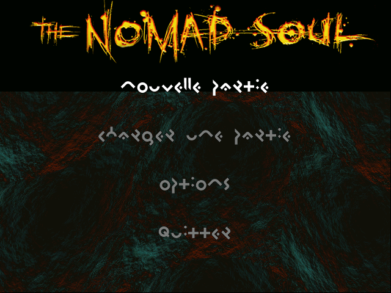
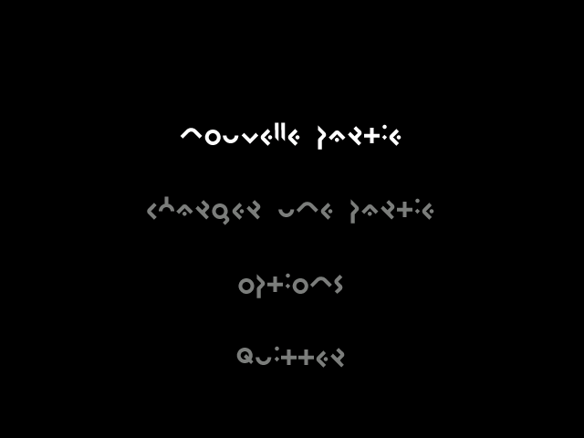

# 10. The interface

← [Audio](09-audio.md) · [Contents](README.md) · next: [The port](11-the-port.md)

---

## In short

The game has **37 screens** — the start menu, the options, the save and load
panels, the inventory, the shops, the terminals, the lift. They are described by
a table compiled into the executable, and by a **widget tree** that says what is
on each one: panels, lists, and items at real pixel coordinates over a 640×480
piece of artwork.

There is no per-screen input code. **One shared callback serves all 32 live
screens**, dispatching panel → list → default. And there is no per-screen answer
mechanism either: a screen's reply is written into **one global variable**, by
one of 17 places in the executable.

The text is drawn from thirteen fonts shipped as `.FNT` files, each glyph a
coverage map rather than a bitmap, painted through a colour ramp — with a
markup language for colour, indentation and alignment embedded in the strings.

  
  
   <em><b>Left:</b> the original engine's framebuffer. <b>Right:</b> the same four labels drawn by the port out of the game's own fonts — 6132 pixels painted, at the coordinates the widget tree gives them.</em>

## In detail

### The 37 screens

The definition table is 92 bytes a row. The **order was confirmed from the
code** — field `+4` runs 0..36 — rather than assumed from the layout. 11 of 11
bitmaps and 18 of 18 text files resolve into the shipped tree. Each screen has
3 slots and an open/run/close state machine.

Two screens got their names from the data: 13 is `DEN`, 24 is `BAR`.

### The widget tree

Screen → panel → up to 10 lists → items, with four flag banks and a 72-byte map
per item. Lifted to `tables/ui_widgets.json`: **35 panels, 93 lists, 411
items**, the option pages, the name-field switch and the answer sites.

The background is a **tile map** — 10×8 tiles of 64×64 on a 640×480 sheet, 11 of
11 resolving — with 8 animation oscillators driving it. That tile map is why a
frame comparison must be careful: across three captures of the same screen, the
title bitmap and all four labels' glyph pixels are **identical, mask and
values**, while the frame as a whole differs by **52%**. A check may assert the
text; it must not assert the scene.

### The input path

One shared callback for all 32 live screens — **no per-screen handlers**. The
14-slot binding word is shared with the `.CTL` runtime from
[chapter 6](06-actors.md), edge-filtered by mask `0x203F`, and dispatched panel
→ list → default.

The confirm / back / close keys are `E` / `R` / `TAB` — except that they are
not, and the correction is a good one. `0x004C65B8`'s E and R are the live
table's **static initialiser**, overwritten by `Game_Init` before the first
frame; the actual default scheme puts ENTER and SPACE in slots 4 and 5. **No
player ever saw E or R.** The port keeps the initialiser precisely so that
overwrite is observable.

### The per-screen callbacks, and the trap they exposed

The screen table names 30 open/close callbacks, and **26 of them are absent from
the decompilation** — not because of anything about their code, but because
nothing *calls* them. They are dwords in a table, and IDA's auto-analysis makes
a function where it sees a call.

Worse, the tool that recovers a function by anchoring on the listing's own
labels then **snaps to the next one and returns a different function without
saying so**. Four of the 26 silently returned one unrelated block.

The prediction rates are measured, and asserted, so this stays honest: over the
33 addresses the screen table names, predicting "has a label" from *starts with
a push* is right **22 of 33**; predicting it from *has at least one direct call
site* is right **29 of 33**.

What could be recovered anyway, by decoding the opens' stores rather than
looking for their code: **35 string ids and 22 tags**, with all 29 that sit on a
screen with a text file naming a non-empty string in it.

### The answer layer

A screen's reply is one global, `dword_930750`, with **17 writers** enumerated
from the image. Only 3 of them are inside a function IDA labelled, for the
reason above.

The terminal family turned out to be a second `Ui_OpenShop`: seven screens on
one panel, one activate callback, a seven-case jump table switching on the
screen's own parameter — and the parameters are 0..6 with no gap or repeat,
which is what makes the case index the parameter. **Case 4 falls through into
case 6**, which reading the arms independently would miss.

A linear scan over that jump table does not merely miss the shop titles, it gets
them **wrong**: it keeps the last arm and binds all ten shops to string 19.
Decoded properly, eight of the ten titles name their own screen; shifting the
table one place takes that 8 to 0.

The corpus cross-check: of the **242** `ui.open` sites over 25 screens (241 in
script slots, **1 in a `+4` startup script** — which is why a slot-only walk
sees no start menu), 15 keep the answer and 10 discard it, and **no site is
attributed only to screens that discard**.

### The options menu

74 rows, every label and caption resolving in `IAM\Options`; a 13-page tree with
read/apply hook pairing proven. **Page 12 is built and unreachable.**

Row 6 is the crowd density from [chapter 6](06-actors.md) — the menu setting
that multiplies the number of people on a street.

### The text renderer

13 fonts keyed by an ASCII letter, all shipping. **2 899 glyphs, 0 outside their
file, 0 overlapping.** Pixels are **coverage 0..31** indexed into a colour ramp,
not a bitmap.

The markup embedded in the strings — `{f}` for font, `{I}` for colour, `{X}`,
`{B}` and others — is decoded, correcting an earlier reading in
`docs/FILE_FORMATS.md`.

### The I2D back end

Covered in [chapter 8](08-rendering.md). What matters here is that it makes the
interface the **one part of the picture that can be reproduced exactly**, because
every primitive ends in a memory copy:

| result | |
|---|---|
| the menu's deterministic region | **66 560 / 66 560** pixels |
| the load panel's selection outline (four quads) | **1 518 / 1 518** covered pixels |
| its connector to the thumbnail — another quad, not a line | **138 / 138** |
| `Text_DrawRun` | **6 132 / 6 132** |

That outline result also **pins the half-open span**: closing the `[left,
right)` range covers 1 552 pixels, 20 of which the engine never lit.

And a negative result kept rather than discarded: the I2D **line and triangle
primitives cannot be raised from the interface at all.** `Ui_DrawItem`'s
vocabulary is FILL (a quad), OUTLINE (four quads), CURSOR, ARROWS and MARKER
(triangles) and SPRITE (a blit) — **no line** — and exactly one item in the whole
lifted widget tree carries the arrows or marker bits, on a child panel no screen
reaches. So no reachable screen draws a triangle either.

### How the port does it

`engine/src/ui/` walks the widget tree with the engine's **own input words**:
28 screens, **0 disagreements** with the independent Python implementation.

The start menu **answers for itself** — and the walk is *gated*, which is the
detail that makes it a model rather than a mock: `Confirmer` refuses an empty
name field, so the walk has to type a name first. It is also answered **by
scancode**, through the live binding tables and the edge filter, reaching the
same answer the reference reaches when handed the input words directly. Held
rather than released, the third frame adds no edge and there is no answer — so
the filter is *shown* to matter.

The other 29 screens keep their native hooks and are **not modelled**; the
invariant is that none of them ever answers through an unmodelled path.

**The sneak — the first screen the player opens** (2026-09-04). Kay'l's
handheld device is screen 9, opened by TAB through the `.CTL` and
`tab_special_move[0]`, and the port now draws it as the engine draws it: the
nine rows the device's pages **share** with one global picking their source,
the highlight (`Ui_DrawItemCursor`, oscillator 3), a page painting itself in
its tab icon's colour, the fill whose blend is the inverse of source-over,
the three 3D previews, the examine page's description, and the object flow —
a row opens the verbs, `Utiliser` posts message 20 to the world or takes an
object in hand, `Utiliser sur` is a mode with a gate that matches nothing, and
the bank of a taken object reaches the inventory (`docs/UI.md` §3b from "The
device's nine rows are SHARED", §3d "What OPENS the sneak", §3g;
`todo/sneak.md`; `verify.py: engine sneak`). Six play reports shaped it, and
the last two verbs were dead on `main` for a day because a row branch
swallowed the confirm bit — caught by a reader, bisected in worktrees.

## Where it lives

| | |
|---|---|
| findings | [`docs/UI.md`](../docs/UI.md) — the I2D layer, the 37 screens, the 45 sounds, the options tree, fonts and markup |
| lifted tables | `tables/ui.json` (37 screens, 45 sounds, 74 option rows), `tables/ui_widgets.json` (the widget tree and the answer sites), `tables/key_bindings.json` |
| the port | `engine/src/ui/` — `i2d.*`, `widgets.*`, `screendraw.*`, `text.*`, `surface.*`, `options.*`, `iamtext.*` |
| the reference | `tools/sim/ui.py` — five panels modelled |
| tools | `tools/ui_tables.py`, `tools/fnt.py`, `tools/uitext.py` |
| to drive it | `python3 tools/omkweb.py` → `/ui` — stateless: it sends the whole key history and the server replays it, so undo is dropping the last key |
| checks | `verify.py: ui page`, `ui input`, `ui answers`, `engine I2D blit`, `engine input`, `sim: ui coverage`, `engine sneak` |

## What is not settled

* **The per-screen native callbacks are not ported** — the flag broadcasts and
  the item bindings are, the answers the callbacks write are not. Reachable
  tier: 5.
* **14 screens share result variable 19**, so no per-screen comparison test
  exists. Recorded rather than left as a gap.
* **The `IAM\<Screen>` text archives** are not ported (the save file and its
  directory are).
* **The I2D blend cannot be checked from a single capture** — mode 1 is 50%
  against an animated background.
